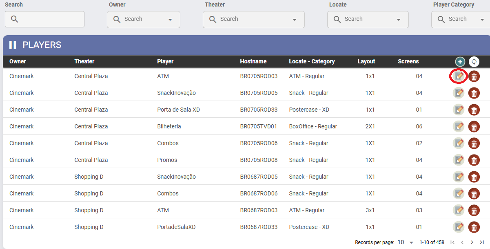
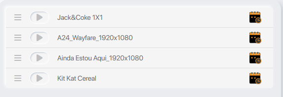
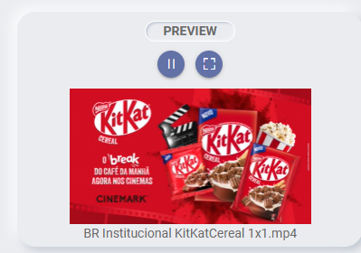

# Criação de playlists

Última atualização: Set. 16, 2025

---

---

## 1. Edição de player

Na tela inicial de “All Players” clique no ícone destacado da imagem abaixo para acessar a **edição de players**.

1. Ao clicar no ícone “
  
  ” a tela abaixo é aberta.

1. Na parte superior está a informação do player acessado:

1. No exemplo temos:

`0705 | Central Plaza        BR0705ROD03|ATM`

Onde:

- **0705**- Código do cinema **Central Plaza**.
- **BR0705ROD03** - Hostname.
- **ATM**- Nome do player.

1. No canto superior direito está a opção “**SAVE**”, clique sempre que fizer alterações.

---

### 1.1 Configuração de Playlist

Os menus disponíveis na tela de playlist são:

1. **Playlist**
2. **Settings**
3. **SYNC**
4. **Layer**(Configuração migrada para a seção **Overlay**)
5. **Event**(Configuração migrada para a seção **Overlay**)
6. **Lobby**(Configuração migrada para a seção **Overlay**)

#### 1.1.1 Playlist

1. **Name:** Nome da playlist
2. **Description:**Breve descrição da playlist
3. **Format:**O formato das mídias que compõem a playlist (Ex.: 1x1, 2x1, 4x2, etc.)
4. **Ícone “**
  
   **”:**Ao clicar, será exibida a tela de cadastro abaixo, contendo os campos descritos acima e também o campo “**Media Types**” para selecionar os tipos de mídia que farão parte da playlist. *SAVE* para criar a nova playlist.

##### **Edição de playlist**

Após a criação clique no ícone “

” para editar.

A tela abaixo será exibida.

1. Na parte superior da tela aparece o identificador do player/playlist no seguinte formato:

`001 - MOG EX PLAYER EX PLAYLIST | 1X1 H 0123456789`

Onde:

- **001 - MOG:**Código e o nome do cinema.
- **EX PLAYER:**Nome do player.
- **EX PLAYLIST:** Nome da playlist
- **1x1:**Formato do player.
- **H:** Orientação da mídia no player:
  - **H**para horizontal
  - **V**para vertical.

1. **Ícone “**
  
  ” **de expansão:**Ao clicar, são exibidas todas as mídias que atendem aos critérios definidos na criação do player/playlist. Os critérios são:
  1. **Orientação:**a orientação do **player** (**H**orizontal ou **V**ertical).
  2. **Formato:** Definido na criação da **playlist**.
  3. **Media type**: o(s) *Media Types*selecionados na criação da **playlist**.

Duplo clique para inserir as mídias na playlist.

1. **Campo de busca**: Utilize para pesquisar o nome da mídia.
2. Ao lado direito do campo de busca estão os *Media Types*selecionados para essa mídia. Selecione um ou mais para alternar a exibição entre as mídias.
3. “**ORDER BY**”: Clique para selecionar a ordem de exibição entre **alfabética**e por **data de upload**.

1. 
  : Utilize para salvar as alterações.
2. 
  : Clique para limpar as mídias selecionadas.
3. 
  : Após a seleção das mídias e o salvamento das alterações, clique para exibição das mídias conforme elas aparecerão no player.
4. 
  : Clique para alternar a visualização entre segundos e minutos.
5. 
  : Navegue entre os dias para visualizar como a playlist está programada.

Após a seleção das mídias, a exibição ficará assim:

Note que o botão SAVE está com a borda amarela, informando que há alterações não salvas.

##### **Opções de reprodução da mídia**

O ícone

 permite uma seleção personalizada do período de dias da exibição da mídia.

Ao passar o mouse sobre o ícone

 um menu é aberto:

1

2

3

4

5

###### Imagem 12 - Menu de edição.

1. A mídia será reproduzida apenas **no dia atual**.
2. Programar a mídia para ser exibida **todos os dias**.
3. Agrupamento de mídias em uma *subplaylist*. Ao utilizar uma subplaylist, a exibição ocorre de forma alternada:
  1. São exibidas todas as mídias da playlist principal (fora da subplaylist).
  2. Em seguida, é exibida **uma mídia da subplaylist**.
  3. No ciclo seguinte, a próxima mídia da subplaylist é exibida, e assim por diante, até que todas sejam apresentadas de forma rotativa.
4. Seleção personalizada de exibição (dias da semana, período do dia e tempo de exibição).
5. Excluir mídia da playlist.

Este campo apresenta o *preview* da mídia selecionada. Interaja com os ícones para **pause/play** e **expansão em tela cheia**.

---

#### 1.1.2 Settings

Configuração de cartelera/grade do player. Afeta os plugins *Showtimes, Boxoffice* e *Postercase*.

1. **Grid Path**: Endereço da API de cartelera/grade.
2. **Order**: Ordem de importância das sessões.
3. **API Token Auth**: Chave de autorização para acesso à API. Essa chave é fornecida pelo cliente. Ex.: E24017B6-3977-47F6-BBA1-558715B6004F
4. **API SmartPlayer**: Endereço da API de Combos, para players de Snack que exibem vídeos de combos na playlist de promoções.

---

#### 1.1.3 Sync

Tempo em minutos estabelecido para que o player faça cada tipo de sincronização.

---

#### 1.1.4 Layer - Configuração migrada para a seção **Overlay**

Vídeo exibido sobreposto ao conteúdo principal do player.

- O formato do *layer* segue a mesma configuração da playlist e da montagem do player.
- Esse recurso é utilizado, em geral, nas bilheterias dos cinemas.

---

#### 1.1.5 Event - Configuração migrada para a seção **Overlay**

Mídia programada em uma playlist específica de evento.

- Quando ativa, sobrepõe todo o conteúdo do player.
- Permite definir um período de exibição (horas ou dias) na configuração.

---

#### 1.1.6 Lobby - Configuração migrada para a seção **Overlay**

Recurso que permite a sobreposição de conteúdo adicional sobre o conteúdo principal, sem interromper ou ocupar totalmente a programação atual.

- Utilizado para exibir anúncios ou mensagens temporárias.
- O conteúdo principal continua sendo exibido normalmente em segundo plano.

