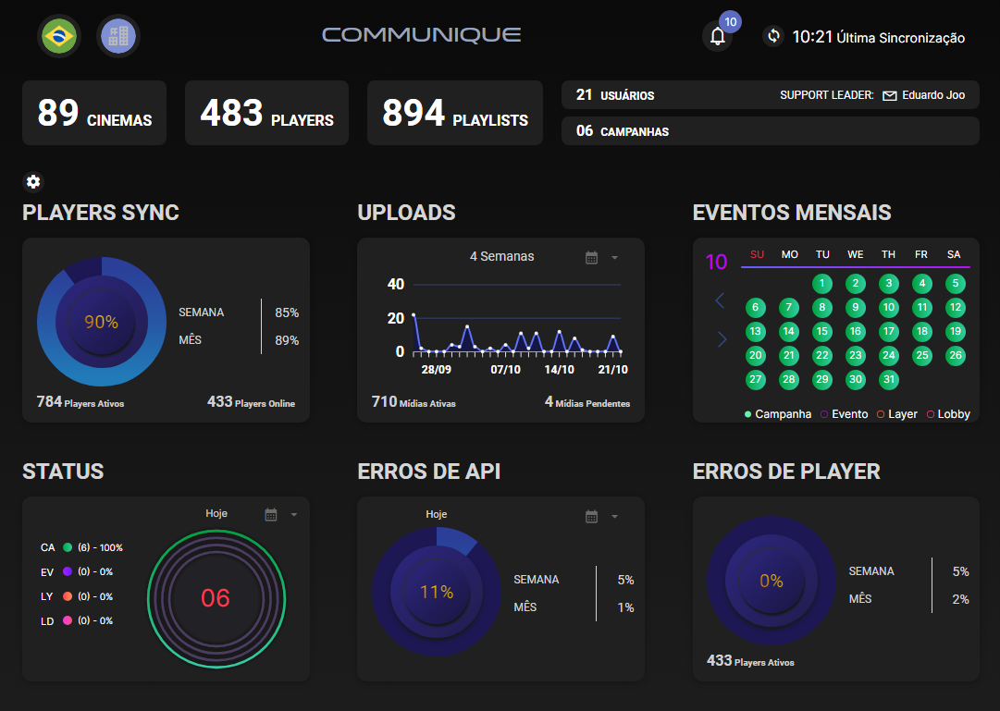
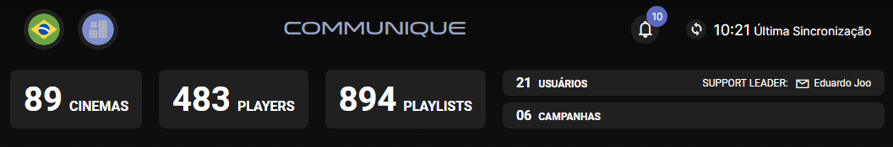
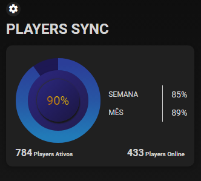
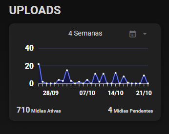
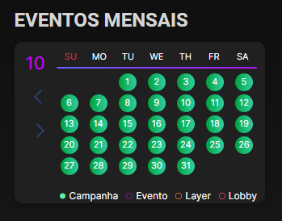
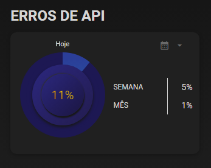
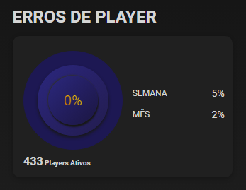

# Dashboard

Última atualização: Out. 29, 2025

---

---

## Descrição

É a tela inicial do Communique. O dashboard fornece acesso rápido a informações e configurações globais, facilitando a navegação e o gerenciamento do sistema:

---

## 1. Parte Superior

1. **País:** permite ao usuário selecionar o país para o qual deseja visualizar dados e configurações.
2. **Owner:** permite escolher entre diferentes owners.
3. **Total de Cinemas:** exibe o número total de cinemas.
4. **Total de Players:** mostra a quantidade de players.
5. **Total de Playlists:** informa o número de playlists disponíveis..
6. **Total de Usuários:** quantidade de usuários registrados no sistema.
7. **Total de Campanhas Programadas e Ativas:** mostra o número de campanhas que estão programadas.
8. **Support Leader:** exibe o nome do líder de suporte responsável pelo país selecionado.
9. **Notificações:** informa o usuário sobre atualizações e alertas do sistema.
10. **Refresh:** permite atualizar manualmente os dados exibidos no dashboard.

---

## 2. Players Sync

Gráfico de monitoramento do status de sincronização dos players no sistema:

1. **Gráfico:** exibe a porcentagem de players sincronizados em relação ao total de players no sistema.
2. **Players Ativos:** mostra a quantidade de players que estão em operação no momento.
3. **Players Online:** indica o número de players conectados e disponíveis para sincronização.
4. **Porcentagem na Última Semana:** exibe a taxa percentual de players sincronizados nos últimos sete dias.
5. **Porcentagem no Último Mês:** mostra a taxa percentual de players sincronizados nos últimos trinta dias.

---

## 3. Uploads

Gráfico de monitoramento das mídias no sistema:

1. **Gráfico em X e Y:** exibe os dados de uploads no eixo Y em relação a quatro datas do último mês no eixo X.
2. **Mídias Ativas:** mostra o número de mídias que estão atualmente ativas no sistema.
3. **Mídias Pendentes:** indica a quantidade de mídias que ainda precisam ser aprovadas.
4. **Opções de Intervalo de Tempo:** permite rearranjar o gráfico para exibir dados da última semana, 2 semanas, 3 semanas, 4 semanas ou 5 semanas.

---

## 4. Eventos Mensais

Gráfico de monitoramento de eventos, lobbys, campanhas e layers no sistema:

1. **Calendário:** exibe o mês atual e seus dias, mostrando informações programadas para cada dia.
2. **Legenda de Cores:**
  - **Campanha (Verde):** indica que uma campanha está programada para o dia.
  - **Evento (Roxo):** mostra que um evento está agendado para o dia.
  - **Layer (Laranja):** representa que uma layer será exibida no dia.
  - **Lobby (Vermelho):** sinaliza que um lobby está programado para o dia.
3. **Coloração dos Dias:** se algum evento, campanha, layer ou lobby estiver programado para um dia específico, o dia será destacado com a cor correspondente à legenda.

---

## 5. Erros de API

Gráfico de monitoramento dos erros de API:

1. **Gráfico de Porcentagem:** mostra a quantidade de erros de API, representada em forma de porcentagem.
2. **Intervalos de Tempo:** exibe os dados de erros de API para hoje, última semana e último mês.

---

## 6. Erros de Player

Gráfico de monitoramento dos erros de Players:

1. **Gráfico de Porcentagem:** mostra a quantidade de erros de players, representada em forma de porcentagem.
2. **Intervalos de Tempo:** exibe os dados de erros de players para hoje, última semana e último mês.
3. **Número de Players Ativos:** informa a quantidade total de players que estão ativos no sistema no momento.
