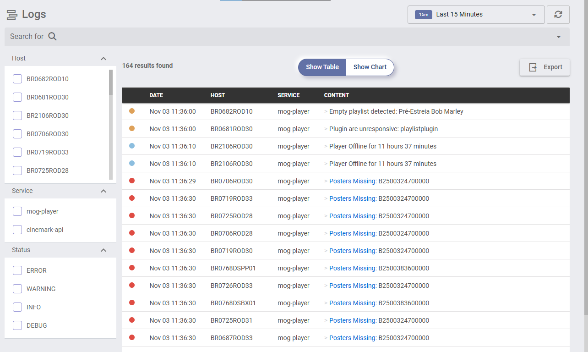

# Logs

Última atualização: Nov. 3, 2025

---

---

## Descrição

A tela de **Logs** apresenta o registro detalhado de eventos, alertas e mensagens do sistema, permitindo o acompanhamento e diagnóstico em tempo real das operações realizadas pelos players e serviços integrados.

---

## 1. Logs - Tela inicial

Na parte superior, há um campo de **busca (“Search for”)**, que possibilita filtrar registros específicos por palavra-chave, facilitando a identificação de ocorrências relacionadas a um player, serviço ou evento determinado.

Abaixo, estão disponíveis **filtros de refinamento** organizados em três categorias principais:

- **Host** – lista todos os players ou dispositivos identificados pelo código de hostname (ex.: *BR0682ROD10*), permitindo selecionar um ou mais para análise específica.
- **Service** – apresenta os serviços do sistema relacionados aos logs, como **mog-player** (serviço do player local) e **cinemark-api** (serviço de integração com o sistema da rede).
- **Status** – classifica os registros de acordo com o tipo de evento, podendo ser:
  - **Error** – erros críticos de operação.
  - **Warning** – alertas de comportamento anômalo ou instabilidade.
  - **Info** – informações gerais de status e rotina do sistema.
  - **Debug** – logs de depuração técnica para análise avançada.

Na parte superior direita, o **filtro de tempo (“Last 15 Minutes”)** permite definir o intervalo de tempo para exibição dos registros (ex.: últimos 15 minutos, 1 hora, 24 horas, etc.), com botão de **atualização automática (refresh)** para atualizar os dados em tempo real.

O corpo principal da tabela apresenta as seguintes colunas:

- **Date** – data e hora da ocorrência do log.
- **Host** – player ou dispositivo em que o evento foi registrado.
- **Service** – serviço responsável pelo evento (ex.: mog-player, cinemark-api).
- **Content** – descrição detalhada do evento ou erro, incluindo mensagens específicas, códigos de mídia, falhas de conexão, ou ausência de arquivos (*Posters Missing*, *Playlist Empty*, *Player Offline*, etc.).

Cada evento é identificado por um **ícone colorido** à esquerda, indicando seu nível de severidade:

- **Vermelho** – erro crítico.
- **Laranja** – alerta.
- **Azul** – informação.
- **Cinza** – log de depuração.

Na parte superior da tabela, há os botões **“Show Table”** e **“Show Chart”**, que permitem alternar entre a visualização tabular dos logs e uma representação gráfica (estatística) dos eventos registrados. Também há a opção **“Export”**, que possibilita exportar os registros filtrados em formato de relatório para análise externa.

Essa tela fornece uma visão completa e estruturada dos eventos do sistema, permitindo que administradores e equipes técnicas monitorem o comportamento dos players, detectem erros, validem comunicações e tomem decisões corretivas com base em evidências precisas e em tempo real.
