# Playlists

Última atualização: Out. 29, 2025

---

---

## Descrição

Seção destinada ao gerenciamento das playlists criadas no Communique.

Dividida em “**Todas as playlists**” e “**Programação em grupo**”

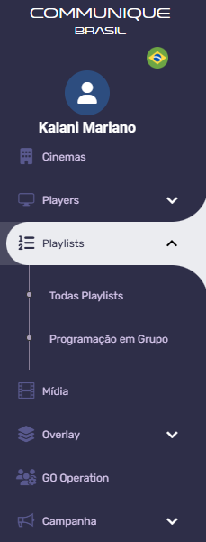

---

## 1. Todas as playlists

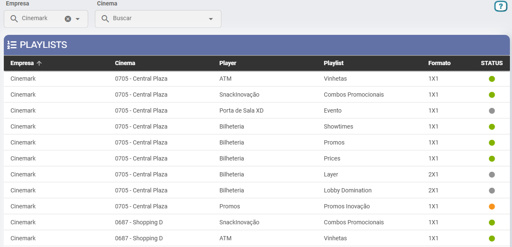

### 1.1 Parte Superior

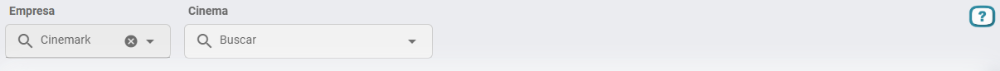

1. **Empresa:**Campo de busca destinado à escolha da empresa responsável pela playlist.
2. **Cinema:**Campo de busca destinado à escolha do cinema responsável pela playlist cadastrada.

### 1.2 Parte inferior - Tabela

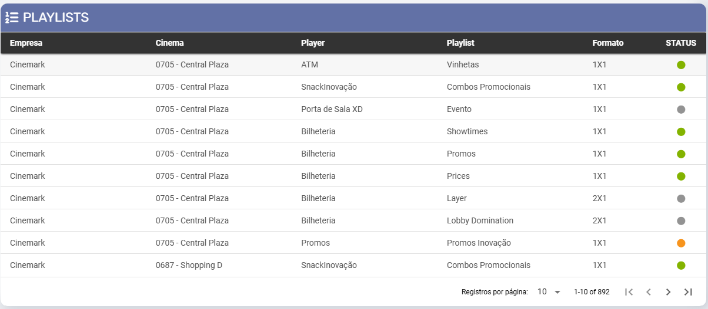

1. **Empresa:**Empresa responsável pela playlist cadastrada.
2. **Cinema:**Cinema onde a playlist está cadastrada.
3. **Player:**Nome do****Player cadastrado na criação da playlist.
4. **Playlist:**Nome da playlist.
5. **Formato:**Formato da playlist.
6. **Status:**Status do funcionamento da playlist. O status pode estar como:
  1. Cinza
    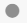
    : Playlist sem mídia.
  2. Amarelo
    
    : Uma ou mais mídias na playlist não estão sincronizadas.
  3. Verde
    
    : Todas as mídias foram sincronizadas.

---

## 2. Programação em grupo

Seção destinada à **inserção**ou **exclusão**de mídias em um grupo de players.

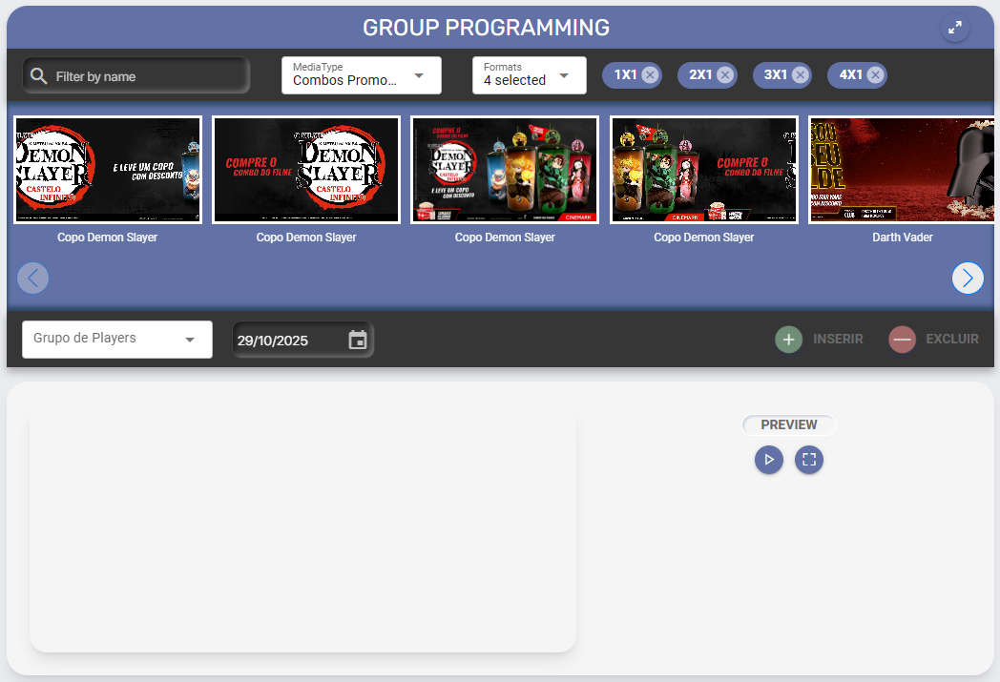

### 1.1 Parte superior

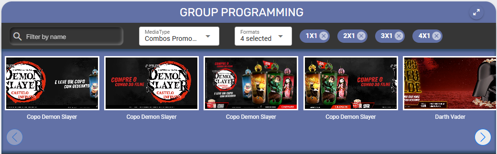

1. **Ícone de expansão**
  
  : Utilize para expandir a lateralmente de acordo com a sua preferência.
2. **Filter by name:**Campo de busca pelo nome da mídia.
3. **Media Type:**Filtragem pelo *Media Type*****das mídias.
4. **Formats:**Filtragem pelo formato das mídias, podendo selecionado mais que um.

### 1.2 Parte inferior

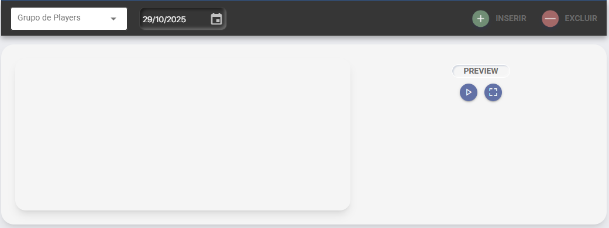

1. **Grupo de Players:**Selecione o grupo de players onde as mídias serão programadas.

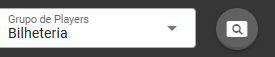

a. Ao selecionar um grupo de players clique na lupa que aparecerá ao lado para visualizar e editar quais players entrarão na programação. A modificação será feita apenas na programação atual.

1. **Data:**Selecione o dia que as mídias serão programadas.
2. **Inserir:**Após a seleção das mídias, clique para inseri-las na programação.
3. **Excluir:**Após a seleção das mídias, clique para exclui-las da programação.
4. Após a seleção das mídias, elas aparecerão conforme a imagem abaixo.

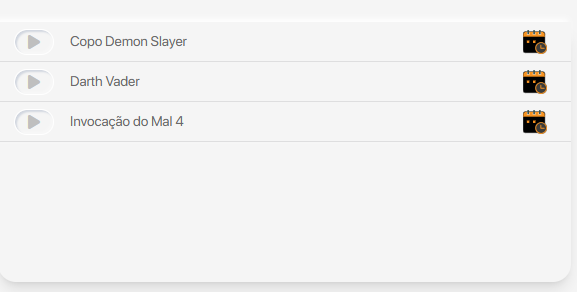

a. O ícone

 permite uma seleção personalizada do período de dias da exibição da mídia.

b. Ao passar o mouse sobre o ícone

 um menu é aberto:

1

2

3

4

5

1. A mídia será reproduzida apenas **no dia atual**.
2. Programar a mídia para ser exibida **todos os dias**.
3. Agrupamento de mídias em uma *subplaylist*. Ao utilizar uma subplaylist, a exibição ocorre de forma alternada:
  1. São exibidas todas as mídias da playlist principal (fora da subplaylist).
  2. Em seguida, é exibida **uma mídia da subplaylist**.
  3. No ciclo seguinte, a próxima mídia da subplaylist é exibida, e assim por diante, até que todas sejam apresentadas de forma rotativa.
4. Seleção personalizada de exibição (dias da semana, período do dia e tempo de exibição).
5. Excluir mídia da playlist.

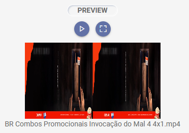

1. **Preview:**Este campo apresenta o *preview* da mídia selecionada. Interaja com os ícones para **pause/play** e **expansão em tela cheia**da última mídia inserida.
