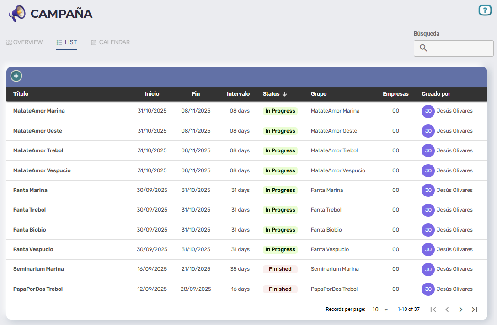
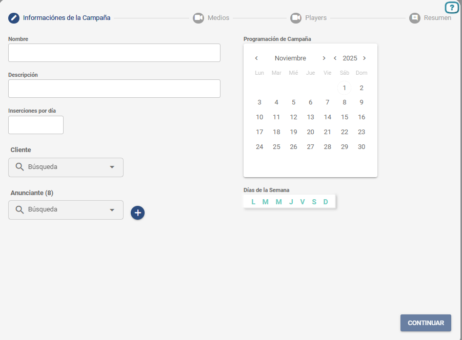
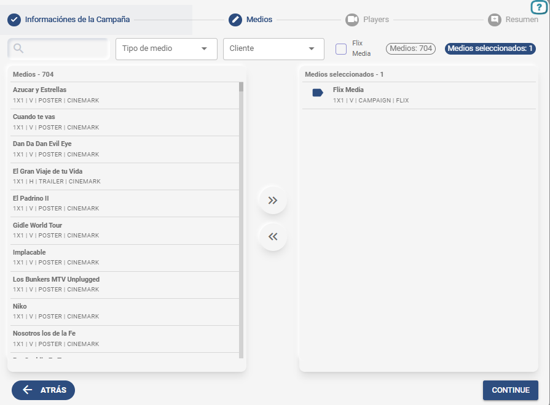
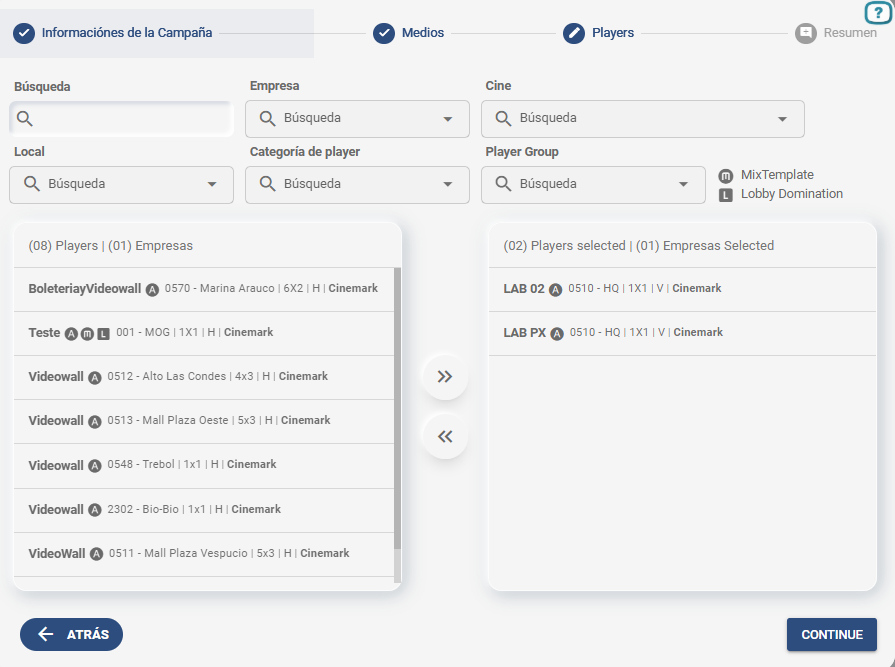
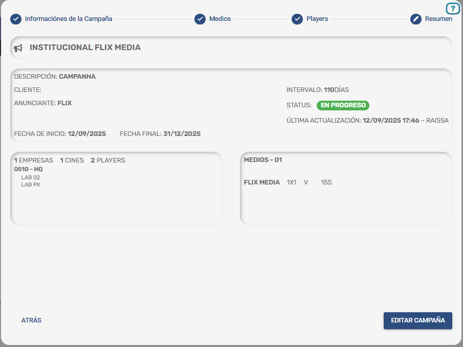

# Campaña

Última actualización: Out. 30, 2025

---

---

## D**escripción**

Sesión utilizada para la **gestión de campañas comerciales**.

Las campañas representan anuncios publicitarios de productos, servicios o marcas contratadas por los clientes e incorporadas a la programación según las fechas y parámetros definidos.

En esta pantalla, el usuario puede visualizar todas las campañas registradas, supervisar su estado, identificar quién creó cada una y acceder a sus detalles individuales. Además, es posible **filtrar, buscar y crear nuevas campañas** desde este módulo

---

## 1. Campaña - Pantalla inicial

#### **1. Menú de Navegación**

- **Visión General:**vista resumida del progreso de las campañas.
- **Lista:**muestra detallada de todas las campañas registradas.
- **Calendario:**visualización de las campañas en formato de agenda o período

#### **2. Botón**  **(Crear Campaña)**

Permite iniciar el registro de una nueva campaña publicitaria.

1. **Campo de Búsqueda**

Permite localizar campañas específicas utilizando términos como:

- Nombre o título de la campaña.
- Nombre del creador.
- Período.

1. **Tabla de Campañas**

Presenta la lista completa de las campañas registradas, con las siguientes columnas:

| Columna | Descripción |
| --- | --- |
| Título | Nombre identificador de la campaña. |
| Fecha de inicio | Fecha programada para el inicio de la exhibición. |
| Fecha final | Fecha programada para el término de la exhibición. |
| Intervalo | Duración total de la campaña (en días). |
| Estado | Situación actual de la campaña:En cursoEn pausaFinalizada |
| Creado por | Nombre del usuario responsable del registro. |

---

## 2. Cr**eación de Campaña**

Haga clic en el ícono ▶️ para iniciar la programación de una campaña.

La programación se divide en cuatro fases:

- **Información de la Campaña**
- **Medios**
- **Players**
- **Resumo**

---

### 2.1 I**nformación de la Campaña**

En esta etapa se realiza el registro inicial de la campaña, definiendo información esencial como el **nombre**, **cliente/anunciante**, **período de exhibición** y la **cantidad de inserciones diarias**.

Una vez completados los datos, el usuario puede continuar con las siguientes etapas de configuración.

1. **Nombre**

Campo para ingresar el nombre de la campaña.
Se utiliza para su identificación y búsqueda dentro del sistema.

1. **Descripción**

Campo libre para incluir detalles opcionales sobre la campaña, como observaciones internas o información sobre el contenido publicitario.

1. **Inserciones por día**

Cantidad de exhibiciones deseadas por día para esta campaña.

1. **Cliente**

Campo de búsqueda y selección del cliente responsable de la campaña.

- Búsqueda por texto.
- Lista desplegable con los nombres registrados.

1. **Anunciante**

Selección del anunciante (marca/producto) asociado a la campaña.
Puede ser el mismo cliente o una marca vinculada.

- Campo de búsqueda.
- Lista desplegable.
- El botón “+” permite registrar un nuevo anunciante sin salir del flujo.

1. **Calendario**
  Selector de fechas para definir el período de exhibición.

- Navegación por mes y año.
- Selección de la fecha inicial.
- Selección de la fecha final.

1. **Días de la semana**
  Selección de los días en los que la campaña será exhibida.
2. **Botón “CONTINUAR”**
  Avanza a la siguiente etapa de configuración de la campaña (medios).

---

### **2.2 Medios**

En esta etapa, el usuario selecciona los medios que serán vinculados a la campaña.

Los medios corresponden a los archivos previamente registrados en el sistema.

El objetivo de esta pantalla es definir qué contenido será reproducido durante la ejecución de la campaña.

1. **Búsqueda**

Campo para localizar medios por nombre.
Útil para encontrar rápidamente contenidos específicos en listas extensas.

1. **Filtro “Tipo de medio”**

Permite filtrar la lista según el tipo de archivo/medio disponible.

1. **Filtro “Cliente”**

Muestra únicamente los medios asociados al cliente seleccionado.

1. **Lista de Medios Disponibles**

Área que contiene todos los medios registrados en el sistema que cumplen con los filtros aplicados.
Cada elemento muestra:

- Nombre del medio
- Información de formato (por ejemplo: 1x1, 2x1, H/V)
- Categoría o tipo
- Cliente asociado

1. **“Flix Media” (casilla de verificación)**

Filtro específico para listar contenidos de *Flix Media* (cuando sea aplicable al entorno).
Activa o desactiva la visualización de este tipo de contenido en la lista.

1. **Columna “Medios seleccionados” (lado derecho)**

Lista los medios elegidos por el usuario para componer la campaña.
A medida que los elementos se seleccionan en la columna izquierda, se muestran automáticamente aquí.

1. **Botón “VOLVER”**

Regresa a la etapa anterior (*Información de la Campaña*).

1. **Botón “CONTINUAR”**

Avanza a la siguiente etapa: *Players*.

---

### **2.3 Players**

En esta etapa, el usuario selecciona los *players* donde se mostrará la campaña.

La correcta selección del *player* garantiza que el medio elegido se reproduzca en el lugar deseado.

1. **Campo “Búsqueda”**

Busca rápida para localizar players específicos por el nombre, código o descripción del lugar.

1. **Filtro “Empresa”**

Muestra y filtra a los players que pertenecen a una compañía específica.

1. **Filtro “Cinema”**

Te permite seleccionar pllayers solo de un cine específico.

1. **Filtro “Local”**

Filtra a los players por ubicación dentro del cine.

1. **Filtro “Categoria del player”**

Filtra a los players según su categoría.

1. **Filtro “Player Group”**

Permite seleccionar grupos de players predefinidos, facilitando campañas que deberían ejecutarse en conjuntos específicos de pantallas.

1. **Iconos de leyenda**

Indicadores que muestran el tipo/funcionalidad del player:

🅼 MixTemplate – Players con plug-ins MixTemplate.
🅻 Lobby Domination – Players que permiten que se muestre el Lobby Domination.

Los *players* con **MixTemplate** y **Lobby Domination** reducen la cantidad de inserciones de la Campaña, ya que cuentan con configuraciones específicas de exhibición que limitan el número total de reproducciones disponibles.

1. **Lista de Players Disponibles**

Muestra todos los *players* que cumplen con los filtros aplicados.
Cada *player* incluye información como:

- Código del *player*
- Nombre del local
- Formato/Resolución (1x1, 3x1, etc.)
- Tipo (V/H - vertical u horizontal)
- Empresa

Además, se presentan íconos que indican capacidades especiales (*MixTemplate*, *Lobby Domination*).

1. **Lista “Players selected”**
  Muestra los *players* ya seleccionados.
  También indica el número total de *players* y empresas seleccionadas.
2. **Botón “VOLTAR”**
  Regresa a la pantalla de selección de medios.
3. **Botón “CONTINUE”**
  Avanza a la siguiente etapa: **Resumen**.

---

### **2.4 Resumen**

Esta pantalla presenta una vista consolidada de toda la información definida en las etapas anteriores del registro de la campaña.
El objetivo es permitir que el usuario valide los datos ingresados antes de finalizar y crear la campaña.

#### **1. Bloque de Información General**

**Descripción:** Descripción de la Campaña completada en el paso 1.
**Cliente:** Empresa contratante.
**Anunciante:** Anunciante vinculado a la campaña.
**Intervalo:** Duración en días de exhibición de la campaña.
**Estado:** Situación actual de la campaña.
**Fecha de Inicio / Fecha Final:** Período de difusión definido en el calendario.

1. **Bloque de Players seleccionados**

Resumen de la distribución de la campaña:

- Cantidad de empresas
- Cantidad de cines
- Cantidad de players

Debajo se lista cada player seleccionado con:

- Código y nombre del cine
- Nombre del player

1. **Bloque de Medios seleccionados**

Indica la cantidad total de medios.
Lista cada ítem con:

- Nombre del medio
- Formato (ej.: 3x1, 1x1)
- Orientación (H = horizontal / V = vertical)
- Duración

1. **Botón “VOLVER”**

Regresa a la etapa anterior (Players) en caso de que sea necesario editar la información antes de confirmar.

1. **Botón “CREAR CAMPAÑA”**

Finaliza el registro y guarda la campaña en el sistema.
A partir de este punto, la campaña pasa a existir como activa o planificada según la fecha y el estado

---
