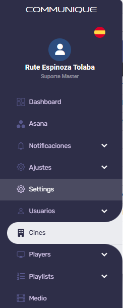
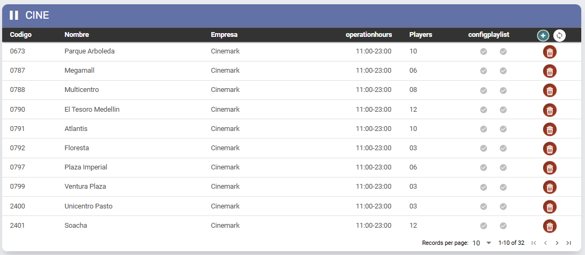
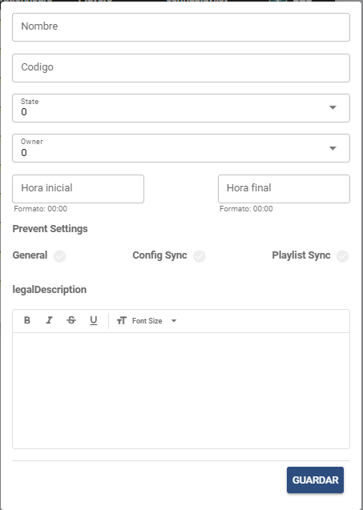

# Cines - Teatro

Última actualización: Set. 12, 2025

---

---

## Descripción

Esta sección sirve para gestionar los cines que utilizan el Player MOG.

## 1. Cines - Teatro

1. **Código:** El código de identificación único del cine. Este código lo proporciona el cliente.
2. **Nombre:** Nombre del cine.
3. **Empresa:** Empresa vinculada al cine.
4. **Operation Hours:** Horario de funcionamiento del cine.
5. **Players:** Cantidad de *players* configurados en el cine.
6. **Config Playlist:** Indica si el cine ya tiene una lista de reproducción (*playlist*) configurada.

1. **Icono “**
  
  **”:**Al hacer clic, se mostrará la pantalla de registro indicada arriba, que contiene los siguientes campos:
  1. **Nombre:**Nombre del cine.
  2. **Código:**Código del cine. Este código es proporcionado por el cliente.
  3. **Estado:**Estado o región donde se encuentra el cine.
  4. **Owner:**Empresa vinculada al cine.
  5. **Hora Inicial:**Hora de apertura del cine. Se debe considerar el formato horario militar para completar este campo.
  6. **Hora Final:**Hora de cierre del cine. Se debe considerar el formato horario militar para completar este campo.
  7. **Configuración de prevención / Prevent Settings:** Bloqueos de sincronización.
    1. **General:**Bloqueo completo del cine. Impide que todos los *players* reciban cualquier actualización.
    2. **Config Sync:** Bloqueo de sincronización de configuraciones.
    3. **Playlist Sync:** Bloqueo de sincronización de *playlists*.
  8. **Descripción legal:**Campo destinado a la descripción legal sobre el medio boleto (*media entrada*) y otras informaciones relevantes, que se muestran en el pie del complemento *Prices*.
2. **Icono “**
  
  ”: Actualiza la página.
3. **Icono** “
  
  ”: Al hacer clic, se mostrará una pantalla de confirmación para eliminar el elemento seleccionado.

---
