# Criação de playlists ES

Última actualización: Set. 16, 2025

---

---

## 1. Edición del player

En la pantalla principal "All Players", haga clic en el icono resaltado de la imagen inferior para acceder a la pantalla de edición del player.

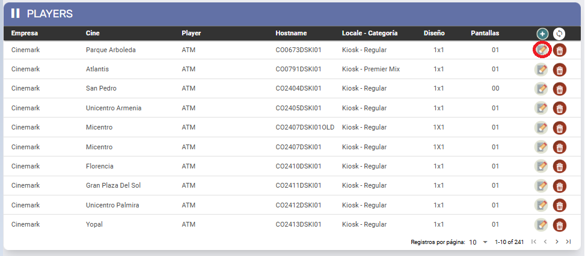

1. Haciendo clic en el icono “
  
  ” Se abre la siguiente pantalla.

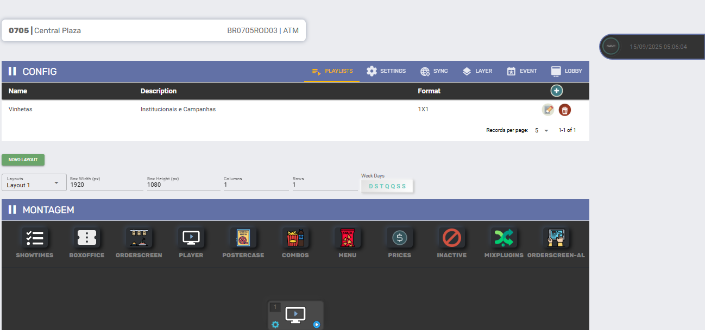

1. La información sobre el player al que se ha accedido se muestra en la parte superior:

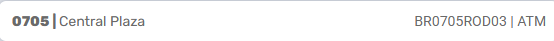

1. En el ejemplo tenemos:

`0705 | Central Plaza        BR0705ROD03|ATM`

Dónde:

- **0705**- Código de cine **Central Plaza**.
- **BR0705ROD03** - Hostname.
- **ATM**- Nombre del player.

1. En la esquina superior derecha está la opción “**SAVE**”, haga clic siempre antes de realizar cambios.

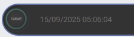

---

### 1.1 Configuración de la lista de reproducción

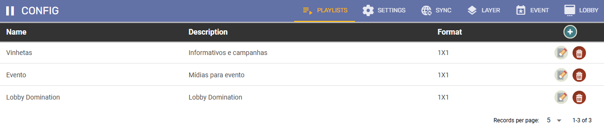

Los menús disponibles en la pantalla de la lista de reproducción / playlist son:

1. **Playlist**
2. **Settings**
3. **SYNC**
4. **Layer**(La configuración se migró a la sesión **Overlay**)
5. **Event**(La configuración se migró a la sesión **Overlay**)
6. **Lobby**(La configuración se migró a la sesión **Overlay**)

#### 1.1.1 Playlist

1. **Nombre:** Nombre da playlist
2. **Descripción:**Breve descripción de la playlist
3. **Formato:**El formato de los medios que componen la lista de la playlist (Ex.: 1x1, 2x1, 4x2, etc.)
4. **Icono “**
  
   **”:**Al hacer clic, se mostrará la pantalla de registro que aparece a continuación, la cual contiene los campos descritos anteriormente y también el campo “**Media Types**” para seleccionar los tipos de contenido multimedia que formarán parte de la lista de reproducción, haga clic en GUARDAR para crear la nueva lista de reproducción.

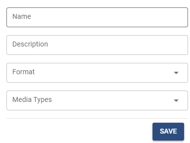

##### **Edición de la playlist**

Después de crearlo, haga clic en el icono “

” para editar.

Se mostrará la siguiente pantalla.

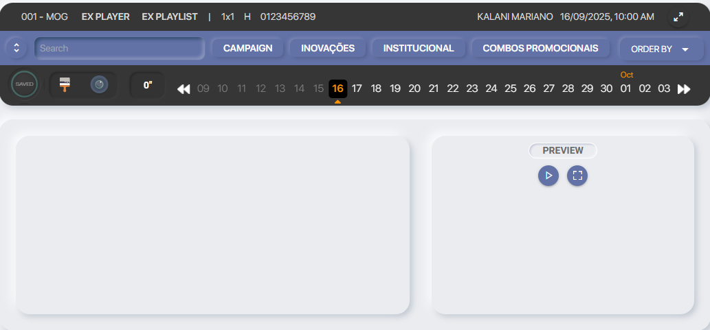

1. El identificador del player/playlist aparece en la parte superior de la pantalla con el siguiente formato.

`001 - MOG EX PLAYER EX PLAYLIST | 1X1 H 0123456789`

Dónde:

- **001 - MOG:**Código y nombre del cine.
- **EX PLAYER:**Nombre del player.
- **EX PLAYLIST:** Nombre del playlist
- **1x1:**Formato del player.
- **H:** Orientación multimedia en el player:
  - **H**para horizontal
  - **V**para vertical.

1. **Icono “**
  
  ” **de expansión:**Al hacer clic en él, se muestran todos los medios que cumplen los criterios definidos cuando se creó el player/playlist. Los criterios son:
  1. **Orientación:**orientación del **player** (**H**orizontal ou **V**ertical).
  2. **Formato:** Definido al crear la **playlist**.
  3. **Media type**: lo(s) *Media Types*seleccionado en la creación de la playlist.

Haz doble clic para añadir contenido multimedia a la lista de reproducción / playlist

1. **Campo de búsqueda**: Utilice esto para buscar el nombre del medio.
2. A la derecha del campo de búsqueda se encuentran los Tipos de Medios seleccionados para este medio. Seleccione uno o más para alternar la visualización entre los tipos de medios.
3. “**ORDER BY**”: Haga clic para seleccionar el orden de visualización entre **alfabético**y por **fecha de carga**.

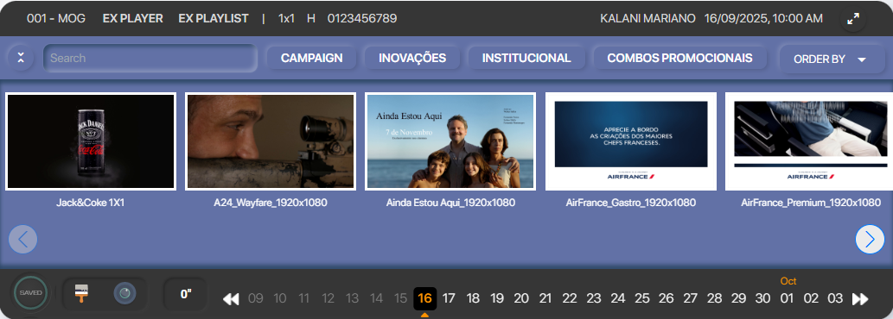

1. 
  : Utilice esta opción para guardar los cambios.
2. 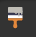
  : Haz clic para borrar el contenido multimedia seleccionado.
3. 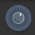
  : Después de seleccionar el contenido multimedia y guardar los cambios, haga clic para mostrar el contenido multimedia tal como aparece en el player.
4. 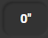
  : Haga clic para alternar entre la visualización de segundos y minutos.
5. 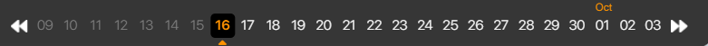
  : Navegue entre los días para ver cómo está programada la lista de reproducción.

Tras seleccionar el medio, la pantalla tendrá este aspecto:

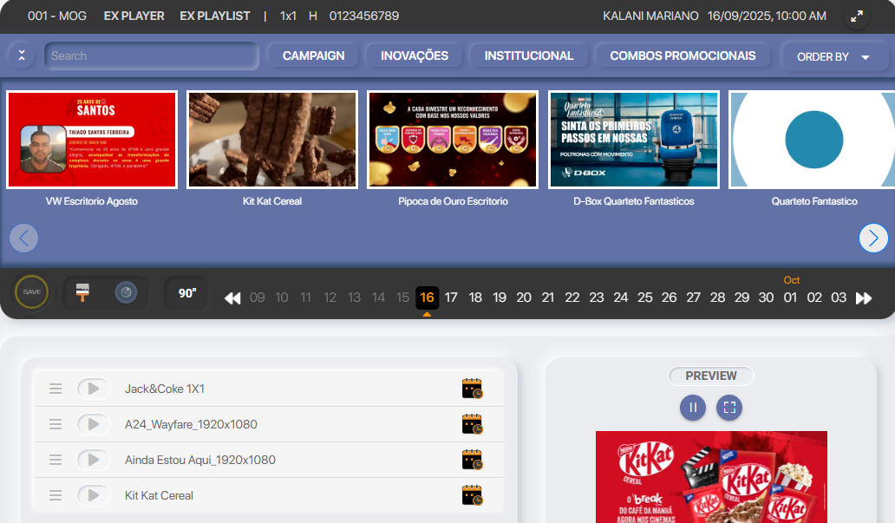

Tenga en cuenta que el botón GUARDAR tiene un borde amarillo, lo que indica que hay cambios sin guardar.

##### **Opciones de reproducción multimedia**

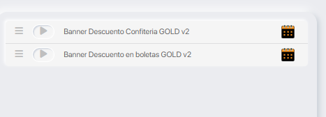

El icono

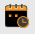

 permite seleccionar de forma personalizada el número de días que se mostrará el contenido multimedia.

Cuando pasas el mouse por encima del icono

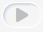

 se abre un menú:

1

2

3

4

5

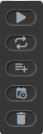

###### Imagen 12 - Menú de edición.

1. El contenido multimedia solo se reproducirá el **día de hoy**.
2. Programe la visualización del contenido multimedia para que se realice **diariamente**.
3. Agrupar contenido multimedia en una *subplaylist*. Al utilizar una subplaylist de reproducción, la reproducción se produce de forma alterna:
  1. Se muestra todo el contenido multimedia de la playlist principal (excepto las subplaylist).
  2. A continuación, se muestra un **contenido multimedia de la subplaylist**.
  3. En el siguiente ciclo, se muestra el siguiente contenido multimedia de la subplaylist, y así sucesivamente, hasta que todos se hayan presentado en rotación.
4. Selección de visualización personalizada (días de la semana, hora del día y duración de la visualización).
5. Eliminar media de la playlist.

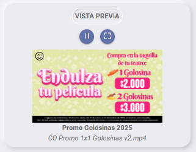

Este campo muestra una vista previa del contenido multimedia seleccionado. Interactúa con los iconos para pausar/reproducir y ampliar a pantalla completa.

---

#### 1.1.2 Configuración

Configuración de la cuadrícula/tarjeta del jugador. Afecta a los plugins *Showtimes, Boxoffice* e *Postercase*.

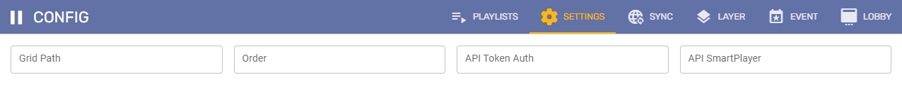

1. **Grid Path**: Dirección API de Cartelera/Grid.
2. **Order**: Orden de importancia de las sesiones.
3. **API Token Auth**: Clave de autorización para el acceso a la API. Esta clave la proporciona el cliente Ex.: E24017B6-3977-47F6-BBA1-558715B6004F
4. **API SmartPlayer**: Dirección API para Combos, para los players de Snack que muestran vídeos de combos en la lista de reproducción de promociones.

---

#### 1.1.3 Sync

Tiempo en minutos establecido para que el player realice cada tipo de sincronización.

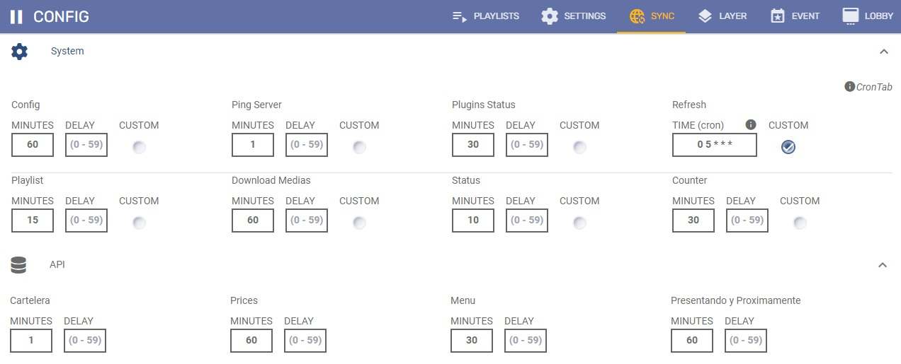

---

#### 1.1.4 Layer - La configuración se migró a la sesión **Overlay**

Vídeo mostrado sobre el contenido principal del player.

- El formato del Layer sigue la misma configuración que la lista de reproducción y la configuración del player.
- Esta función se utiliza generalmente en las taquillas de los cines.

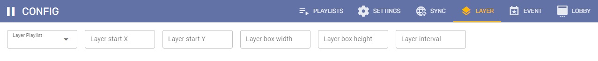

---

#### 1.1.5 Evento - La configuración se migró a la sesión **Overlay**

Contenido multimedia programado en una lista de reproducción para un evento específico.

- Al activarse, superpone todo el contenido del player.
- Te permite definir un período de visualización (horas o días) en la configuración.

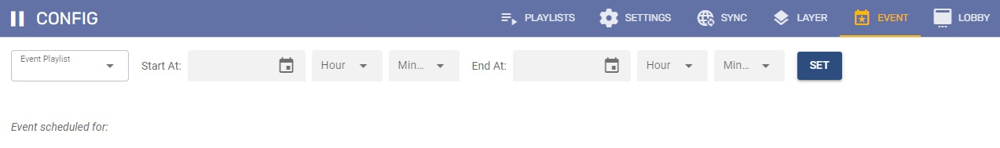

---

#### 1.1.6 Lobby - La configuración se migró a la sesión **Overlay**

Una función que permite superponer contenido adicional sobre el contenido principal sin interrumpir ni ocupar por completo la programación actual.

- Se utiliza para mostrar anuncios o mensajes temporales.
- El contenido principal se sigue mostrando con normalidad en segundo plano.

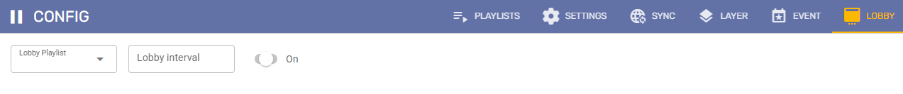
