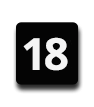
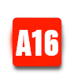
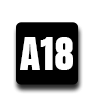
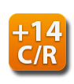
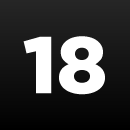
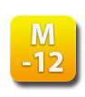
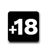
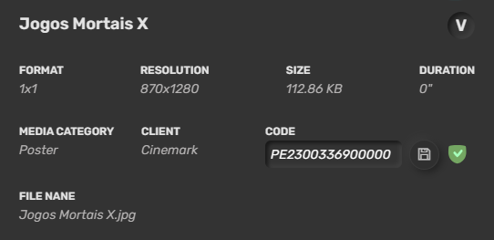
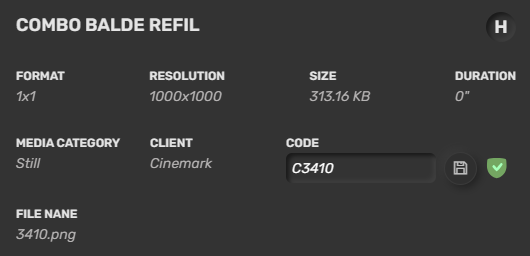
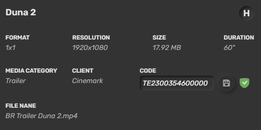

# Glosario

Última actualización: Out. 30, 2025

---

---

## Descripción

En este documento se presentan todas las nomenclaturas utilizadas dentro de **Mog**. Úselo para buscar los significados de cada término.

---

## 1. Censuras

Censura utilizados por cada país.

### 1.1 Brazil

##### **Clasificación**

Clasificación realizada por el Ministerio de Justicia y Seguridad Pública de Brazil.

- 
- Libre - Código Apolo/API "1"

- 
- No recomendado para niños menores de 10 años. - Código Apolo/API "2"

- 
- No recomendado para niños menores de 12 años - Código Apolo/API "3"

- 
- No recomendado para niños menores de 14 años - Código Apolo/API "4"

- 
- No recomendado para niños menores de 16 años - Código Apolo/API "5"

- 
- No recomendado para menores de 18 años - Código Apolo/API "6"

##### **Autoclasificación**

Clasificación realizada por el productor de la obra.

- 
- Libre - Código Apolo/API "13"

- 
- No recomendado para niños menores de 10 años - Código Apolo/API "14"

- 
- No recomendado para niños menores de 12 años - Código Apolo/API "15"

- 
- No recomendado para niños menores de 14 años - Código Apolo/API "16"

- 
- No recomendado para niños menores de 16 años - Código Apolo/API "17"

- 
- No recomendado para menores de 18 años - Código Apolo/API "18"

**Nota.:** Los niños menores de 10 años deben ir acompañados de un adulto responsable para acceder a las proyecciones. A partir de los 10 años, pueden ir acompañados de un adulto responsable o contar con autorización para acceder a películas clasificadas para mayores de 16 años. Las películas clasificadas para mayores de 18 años solo están permitidas para adolescentes de 16 años o más.

---

### 1.2 Chile

- 
- Todos los espectadores - Código Apolo/API "00"
- 
- Todos los espectadores con restricciones - Código Apolo/API "01"
- 
- Todos los espectadores. Sugerida para mayores de 7 años - Código Apolo/API "07"
- 
- Todos los espectadores. Sugerida para mayores de 7 años con restricción - Código Apolo/API "08"
- 
- Mayores de 14 años - Código Apolo/API "14"
- 
- Mayores de 14 años con restricción - Código Apolo/API "15"
- 
- Mayores de 18 años - Código Apolo/API "18"
- 
- Mayores de 18 años con restricción - Código Apolo/API "19"

**Nota.:** Las películas que se encuentran con restricción no permiten la aplicación de descuentos y/o pases gratis para la compra o canje de entradas, dependiendo lo impuesto por las distribuidoras a cargo de cada una, y durante el período de tiempo determinado.

---

### 1.3 Colombia

- 
- Todo el público - Código Apolo/API "00"
- 
- Mayores de 7 años - Código Apolo/API "07"
- 
- Mayores de 12 años - Código Apolo/API "12"
- 
- Mayores de 15 años - Código Apolo/API "15"
- 
- Mayores de 18 años - Código Apolo/API "18"

---

### 1.4 Costa Rica

- 
- Todo el público - Código Apolo/API "00"
- 
- Todo público, niños menores de 7 acompañados de un adulto - Código Apolo/API "11"
- 
- Mayores de 12 años - Código Apolo/API "12"
- 
- Mayores de 15 años - Código Apolo/API "15"
- 
- Mayores de 18 años - Código Apolo/API "18"

---

### 1.5 El Salvador

- 
- Todo el público - Código Apolo/API "00"
- 
- Todo el público. Comprensible para niños menores de 7 años - Código Apolo/API "11"
- 
- Mayores de 12 años - Código Apolo/API "12"
- 
- Mayores de 15 años - Código Apolo/API "15"
- 
- Mayores de 18 años - Código Apolo/API "18"

---

### 1.6 Guatemala

- 
- Todo el público - Código Apolo/API "00"
- 
- Niños de cualquier edad pero acompañados de un adulto - Código Apolo/API "11"
- 
- Público de 12 años en adelante - Código Apolo/API "12"
- 
- Público de 15 años en adelante - Código Apolo/API "15"
- 
- Solo para mayores de 18 años - Código Apolo/API "18"

---

### 1.7 Honduras

- 
- Recomendada para todo el público - Código Apolo/API "00"
- 
- Recomendada para edades a partir de los 7 años - Código Apolo/API "07"
- 
- Recomendada para edades a partir de los 10 años - Código Apolo/API "10"
- 
- Recomendada para edades a partir de los 13 años - Código Apolo/API "13"
- 
- Recomendada para edades a partir de los 16 años - Código Apolo/API "16"
- 
- Recomendada para edades a partir de los 18 años - Código Apolo/API "18"

---

### 1.8 Panamá

- 
- Todo el público - Código Apolo/API "00"
- 
- No para menores de 12 años - Código Apolo/API "12"
- 
- No para menores de 14 años - Código Apolo/API "15"
- 
- No para menores de 18 años - Código Apolo/API "18"

---

### 1.9 Bolivia

- 
- Todo el público - Código Apolo/API "00"
- 
- Mayores de 14 años - Código Apolo/API "14"
- 
- Mayores de 18 años - Código Apolo/API "18"

---

### 1.10 Paraguay

- 
- Todo el público - Código Apolo/API "00"
- 
- Mayores de 13 años - Código Apolo/API "13"
- 
- Mayores de 16 años - Código Apolo/API "16"
- 
- Mayores de 18 años - Código Apolo/API "18"

---

### 1.11 Perú

- 
- Todo el público - Código Apolo/API "00"
- 
- Mayor a 14 años - Código Apolo/API "14"
- 
- Mayor a 18 años - Código Apolo/API "18"

---

## 2. Media Type

1. **Campaing:** Medios de campaña.
2. **Combo Video:** Videos de combos en la versión 1.0 del complemento *Combos*.
3. **Combos Promocionales:** Promociones de snack que incluyen obsequio. *Mediatype* utilizado en
4. **GO Operation**.
5. **Evento:** Medios destinados a eventos.
6. **Informes:** Contenidos informativos del cine.
7. **Innovaciones (Brazil):** Otras promociones o medios exhibidos en el área de snacks del cine.
8. **Institucional:** Videos institucionales del cine o de socios.
9. **Layer:** Medios utilizados en la programación del *Layer*.
10. **Lobby Domination:** Medios utilizados para la programación de *Lobby Domination*.
11. **Menu (Latam):** Vídeos de los platos del menú del teatro.
12. **Poster:**
  Pósteres de películas utilizados en los complementos *Boxoffice*, *Prices*, *Postercase* y *Smartpostercase*.
  Para su exhibición, es necesario completar el campo **CODE** con el código de la película precedido por la letra **P**.

1. **Prices:** Banner o video exhibido en el pie del complemento *Prices*.
2. **Prime (Brazil):** Videos del menú de los cines *Prime* y *Bistrô*.
3. **Promo (Latam):** Otras promociones o medios exhibidos en el área de snacks del cine.
4. **Showtimes:** Banner o video del pie del complemento *Showtimes*.
5. **Still:**Imagen de combo (en formato PNG) utilizada en el complemento *Combos* (tanto en la versión 1.0 como en la 2.0).
  Para su exhibición, es necesario completar el campo **CODE** con el código del combo precedido por la letra **C**.

1. **Trailer:**
  - Tráilers exhibidos en los cines. Pueden incluirse en listas de reproducción (*playlists*) y en el complemento *Smartpostercase*.
  - Para su exhibición en *Smartpostercase*, es necesario completar el campo **CODE** con el código de la película precedido por la letra **T**.

---

## 3. Ubicación

1. **ATM:**Reproductor exhibidos en el área de los cajeros automáticos del cine.
2. **BoxOffice:**Reproductor exhibidos en la taquilla.
3. **Entrance:** Reproductor exhibidos en la entrada del cine.
4. **Lobby:** Reproductor exhibidos en el vestíbulo (*lobby*) del cine.
5. **Lounge:**Reproductor exhibidos en el *lounge*.
6. **Office:**Reproductor exhibidos en la oficina.
7. **Podium:**Reproductor exhibidos en el podio del cine.
8. **Postercase:** Reproductor exhibidos en la puerta de las salas de cine o en *players* que utilizan el *Smartpostercase*.
9. **Snack:** Reproductor exhibidos en el área de snack.
10. **Snack Lateral:** Reproductor exhibidos en el snack lateral.
11. **SnackPrimePrincipal:** Reproductor exhibidos en el snack prime. Utilizado en cines híbridos que poseen snack regular y prime.

---

## 4. Categoría del reproductor

1. **Regular:***Players* de cines regulares.
2. **Prime:***Players* de cines *prime*.
3. **Bistrô:** *Players* de cines *bistró*.
4. **Videowall:** *Players* de videowall.
5. **XD:***Players* de puerta de sala XD.
6. **Lab:***Players* de laboratorio (*lab*).
