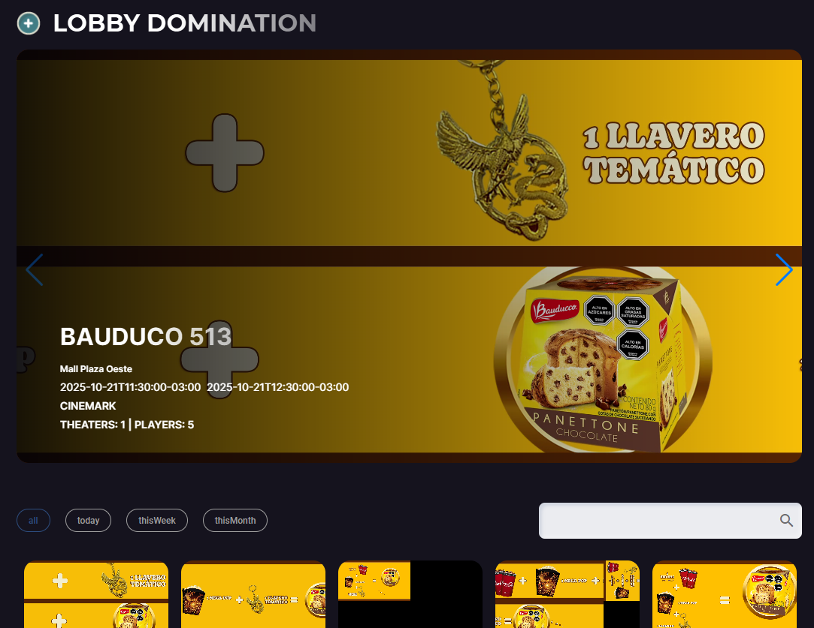
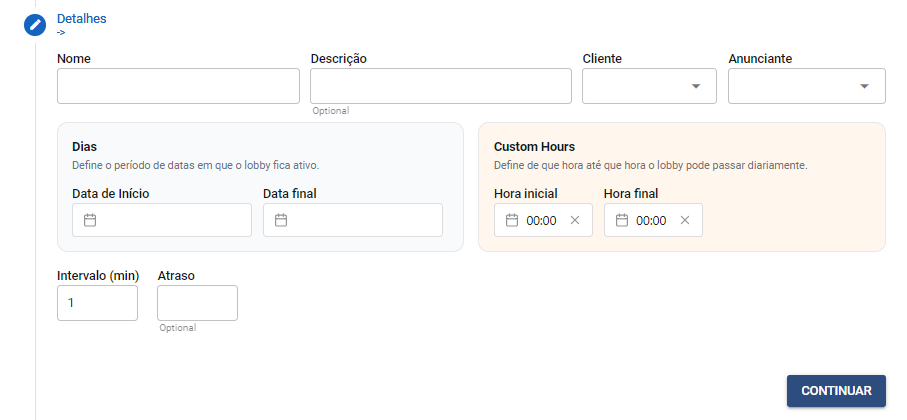
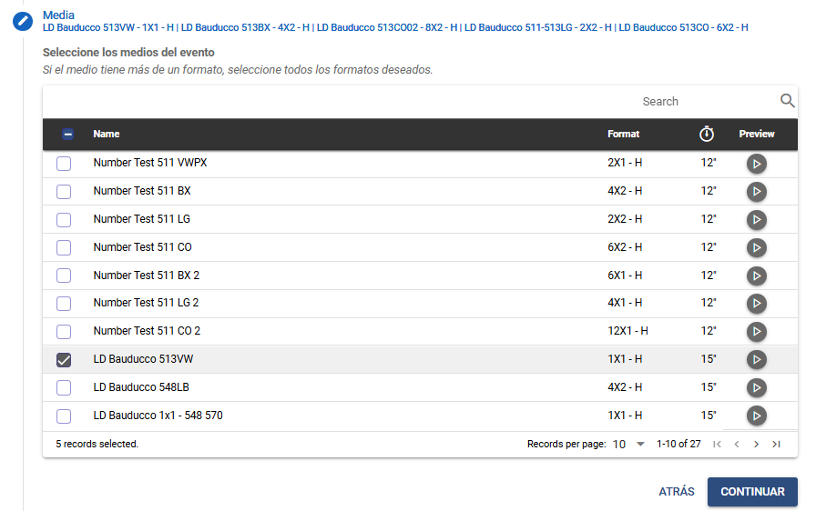
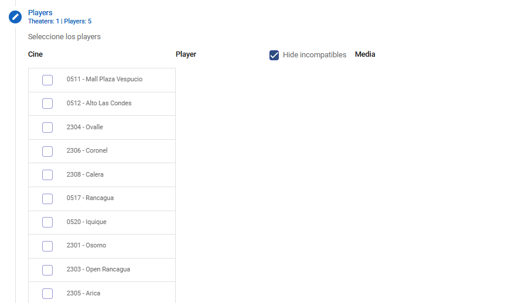
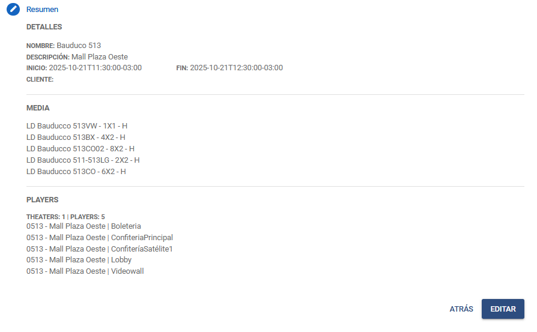

# Lobby Domination - LD

Última actualización: Ago. 20, 2026.

---

---

## Descrição

Sesión destinada a la programación del **Lobby Domination**, modalidad en la que los medias se muestran simultáneamente en todos los players del cine, interrumpiendo temporalmente la programación estándar.

Esta acción ocurre dentro de un intervalo de tiempo predefinido (por ejemplo, 3 minutos) y en un período determinado previamente, garantizando máxima visibilidad al contenido durante ese momento.

---

## 1. Regla de negocio

Atención a las reglas de programación para los diferentes tipos de Lobby Domination

1. Solo se permite programar un anunciante por horario, esto es, si es necesario programar dos anunciantes para un mismo cine, el período debe ser diferente para cada programación. Ej.: Anunciante A, de las 10:00 a las 18:00. Anunciante B, de las 18:00 a las 24:00.
2. Cada LD permite programar hasta dos medios simultáneos. Los medios se alternarán de acuerdo con el intervalo seleccionado.

---

## 2. Lobby Domination - Pantalla de inicio

1. **Botão de criação (+):**Inicia o processo para criar uma nova programação de Lobby Domination.
2. **Card principal em destaque:**Exibe a programação atual/selecionada com:
  - Nome.
  - Descrição.
  - Data e horário de início e término.
  - Nome do cliente.
  - Quantidade de cinemas e players selecionados
3. **Botões de navegação (⟵ / ⟶):**Permitem navegar entre as programações agendadas.
4. **Filtros:**
  - **Todos:** Muestra todas las programaciones.
  - **Hoy:** Exhibe únicamente los eventos del día actual.
  - **Esta semana:** Muestra los eventos programados para la semana en curso.
  - **Este mes:** Exhibe los eventos del mes actual.
5. **Barra de búsqueda:**Te permite localizar horarios por nombre.
6. **Lista de cards inferiores:**Mostrar todas las campañas programadas con miniaturas y acciones (detalle / eliminar).

---

## 3. Programación de Lobby Domination

Haz clic en el icono

 para empezar a **programar el*****Lobby Domination***.

La programación se divide en 4 fases:

- **Detalles**
- **Multimedia**
- **Players**
- **Resumen**

---

### 4.1 Detalles

1. **Nombre:** Campo para introducir el nombre del programa.
2. **Descripción:**Campo opcional para añadir una breve descripción del programa.
3. **Cliente:** Selección del cliente responsable de la campaña.
4. **Anunciante**: Selección del anunciante vinculado a la campaña.
5. **Inicio (fecha):**Define la fecha inicial de exhibición de la programación.
6. **Fin (fecha):**Define la fecha final de exhibición de la programación.
7. **Inicio (hora):**Establece la hora de inicio diaria de la exhibición.
8. **Fin (hora):** Establece la hora de finalización diaria de la exhibición.
9. **Intervalo (min):**Determina el intervalo, en minutos, entre las visualizaciones durante el periodo definido.
10. **Retraso:**Campo opcional para retrasar el inicio del programa en el reproductor, también en minutos.
  - Se utiliza para evitar conflictos cuando la programación debe comenzar simultáneamente en el mismo player, permitiendo que una de ellas se retrase ligeramente.

---

### 4.2 Media

Esta sección sirve para **seleccionar el contenido** **multimedia** que se vinculará al programa.

El usuario puede seleccionar uno o más archivos multimedia de la lista.

Si un mismo archivo multimedia tiene versiones en diferentes formatos, es posible seleccionar todos los formatos deseados.

1. **Campo de búsqueda**: Permite localizar un elemento multimedia específico por su nombre.
2. **Casilla de verificación**: Permite seleccionar o deseleccionar todos los elementos multimedia de la lista.
3. **Nombre:** Muestra el título o la identificación del elemento multimedia disponible.
4. **Formato:** Indica la relación de aspecto y la orientación del elemento multimedia.
5. **Vista previa:**Muestra la duración del elemento multimedia (en segundos) y un icono de reproducción, lo que permite previsualizar el contenido antes de seleccionarlo.
6. **Botón “ATRÁS”**: Regresa al paso anterior sin guardar los cambios.
7. **Botón “CONTINUAR”**: Avanza al siguiente paso del proceso después de seleccionar los elementos multimedia deseados.

---

### 4.3 Players

Esta sesión es responsable de seleccionar el **players** donde se mostrará el contenido multimedia de la programación
La lista está organizada por cine y permite definir qué reproductores son elegibles para recibir el material seleccionado en el paso anterior.

1. **Barra de Búsqueda:**Campo para localizar cines rápidamente escribiendo el nombre o el código.
  - Incluye ícono de lupa para confirmar la búsqueda.
2. **Cinema:**Lista de cines disponibles
  - Cada ítem tiene un botón de selección, permitiendo elegir más de un cine a la vez.
3. **Player:**Al seleccionar un cine, los *players* disponibles se mostrarán en esta columna.
  - Solo se listan por defecto los *players* con *playlist* compatible con la *media* seleccionada.
4. **Mostrar incompatibles:***Checkbox* que, al activarse, muestra todos los *players* del cine, incluyendo aquellos con *playlist* **incompatible**con la *media* seleccionada.
5. **Media:**Muestra cuál *media* es compatible con la *playlist* de ese *player*
  - Si hay una *media* compatible, aparecerá automáticamente seleccionada.

- Si hay más de una *media* compatible, todas se mostrarán sin seleccionar, y el usuario deberá elegir la correcta.

---

### 4.4 Resume

Pantalla final que presenta una vista previa completa de la información ingresada en los pasos anteriores antes de que se creara el evento.

1. **Detalles:**Exhibe los datos generales de la programación:
  - Nombre.
  - Descripción.
  - Fecha y hora de inicio.

- Fecha y hora de finalización.
- Cliente seleccionado.

1. **Media:**Lista de medios incluidos en el programa:
  - Archivos multimedia seleccionados.
  - Formatos/variaciones compatibles.
2. **Players:**Información sobre dónde se mostrará la programación:
  - Número total de cines seleccionados (*Theaters*).
  - Número total de players seleccionados.
  - Lista de players mostrados por el cine:
    - *(*Código del cine → Nombre del cine →*Player).*
3. **Crear**: Confirma y registra el horario con la información proporcionada.
