# Reportes

Última actualización: Out. 31, 2025

---

---

## Descripción

La pantalla de **Informes** centraliza todos los datos y análisis del sistema, organizando la información de forma visual.

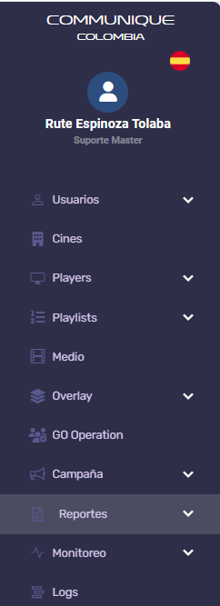

---

## 1. **Reportes - Pantalla inicial**

En esta pantalla se muestran todos los informes que pueden extraerse desde **Communique**.

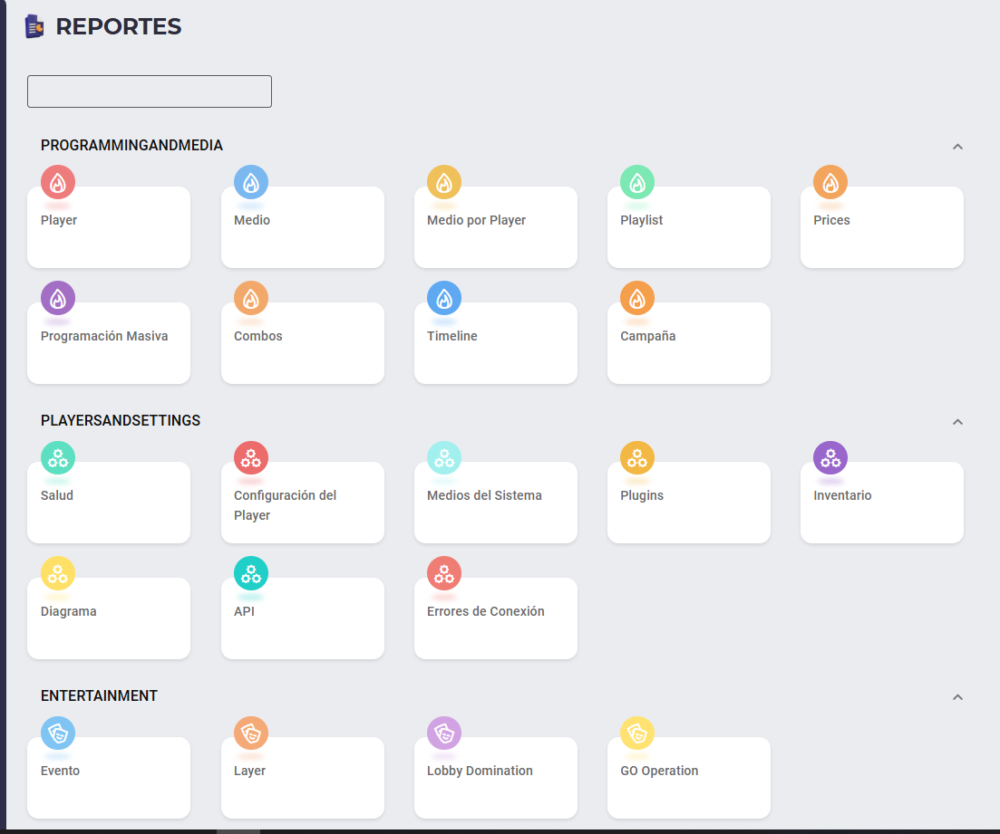

Dividido por secciones:

- **Programación y medios**
- **Players y configuraciones**
- **Entretenimiento**

---

### **1.1 Programación y Medios**

#### 1. Player

Clic para expandir

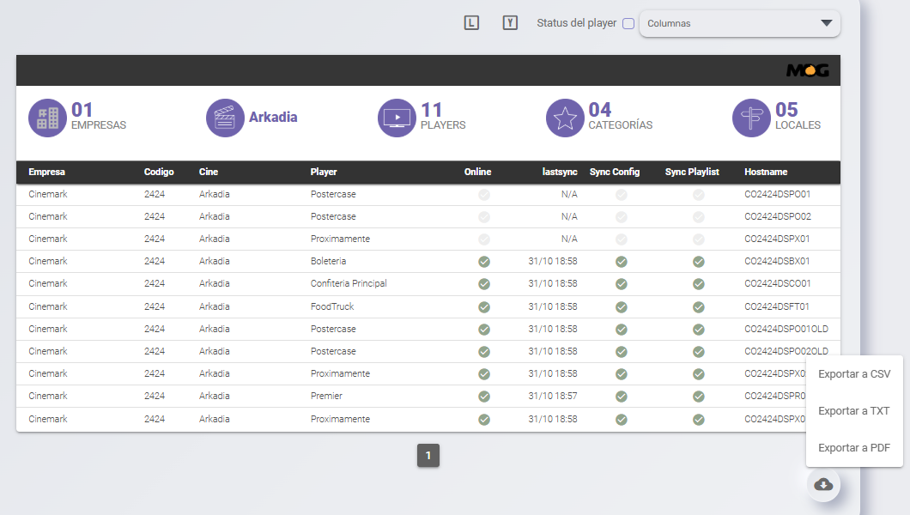

El informe de **Players** presenta una visión detallada del *player* seleccionado, mostrando información operativa y de configuración, incluyendo el estado de actividad, conectividad, datos de identificación, parámetros de visualización y otros indicadores técnicos esenciales para el seguimiento y diagnóstico del dispositivo.

#### 2. Medio

Clic para expandir

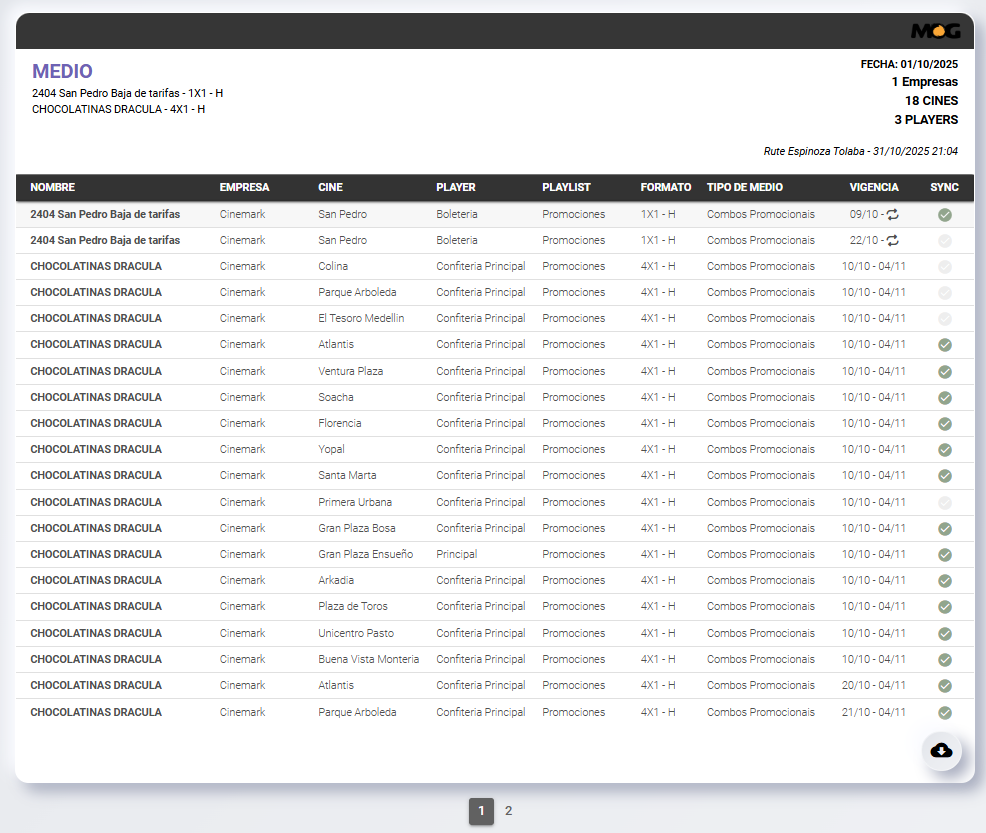

El informe de **Medios** presenta la información y el estado del medio seleccionado en todos los *players* donde se está reproduciendo. Permite verificar su distribución, ejecución y condiciones de exhibición en la red.

#### 3. Mídia por Player

Clic para expandir

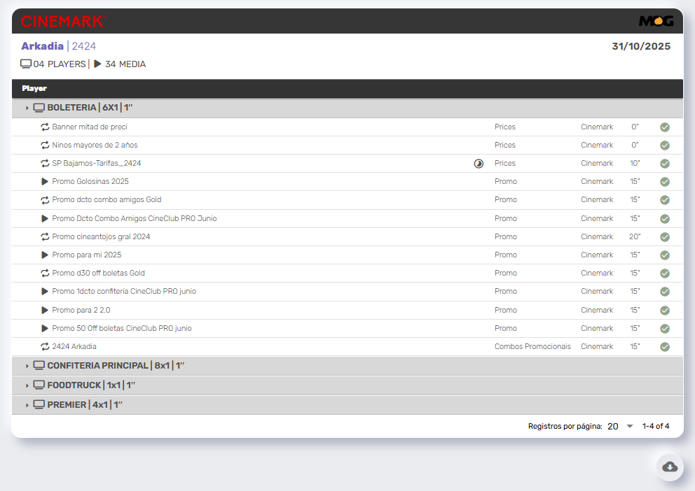

El informe de **Medios por Player** presenta la información de los medios programados específicamente para los *players* seleccionados, permitiendo visualizar todo el contenido asignado, su estado operativo y demás detalles relacionados con la programación de dicho dispositivo.

#### 4. Playlist

Clic para expandir

El informe de **Playlist** presenta la información de las *playlists* programadas para el *player* seleccionado, mostrando el contenido asignado de forma organizada por *playlist*, así como su estado y demás detalles relacionados con la programación de dicho dispositivo.

#### 5. Prices

Clic para expandir

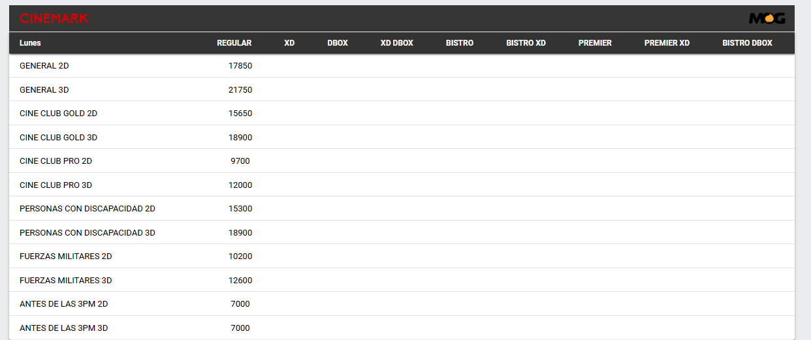

El informe de **Prices** presenta los valores por categoría de entrada para el cine seleccionado. Este informe está disponible únicamente para los países que tienen listas de precios semanales registradas en *Communique* (actualmente, solo Colombia). Permite consultar de forma organizada los precios aplicados por tipo de entrada durante el período semanal vigente.

#### 6. Programación de grupo

Clic para expandir

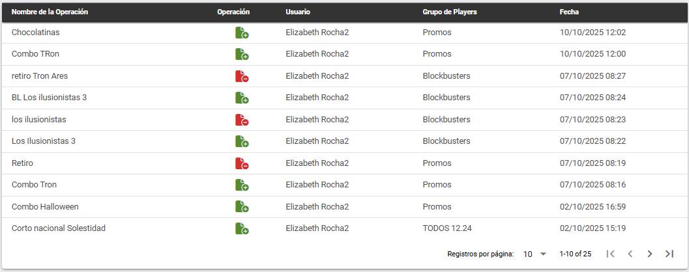

El informe de **Programación de Grupo** muestra las operaciones de programación en grupo realizadas dentro del período seleccionado.
Antes de generar el informe, es necesario filtrar los grupos de *players* deseados, lo que permite visualizar únicamente las acciones aplicadas a los grupos seleccionados.

Al hacer clic en los íconos

 o

, se mostrará una lista más detallada de los *players* afectados por dicha operación, como se ilustra en la imagen a continuación.

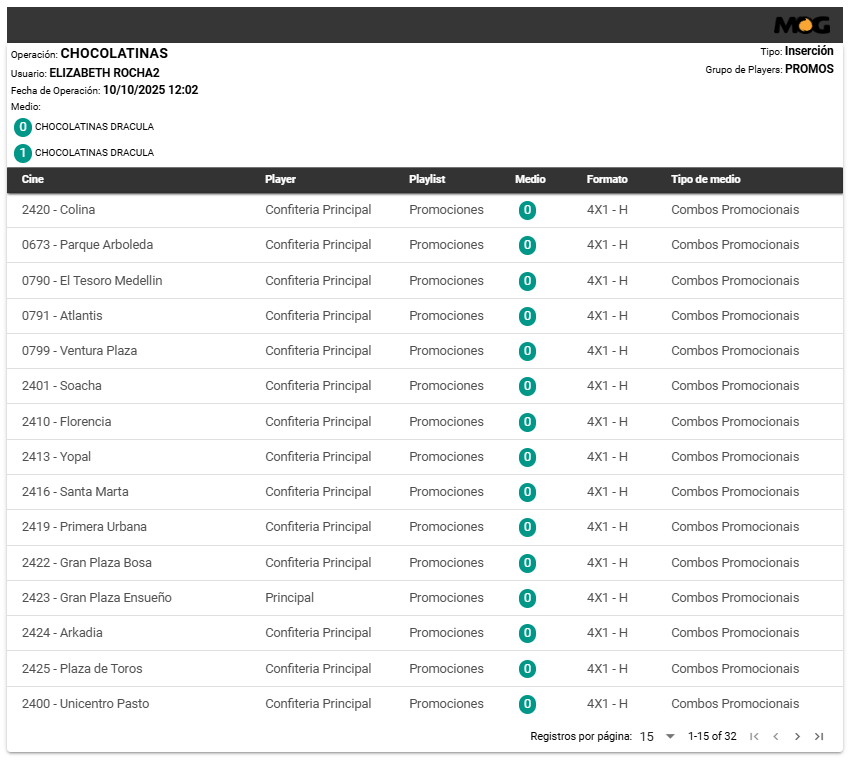

#### 7. Combos

Clic para expandir

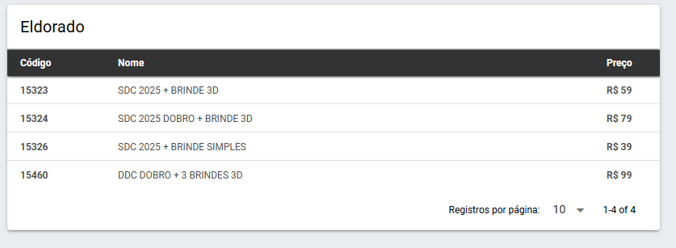

El informe de **Combos** muestra la lista de *combos* registrados para el cine seleccionado, organizada por código, nombre y precio, permitiendo una consulta clara y estructurada de las ofertas disponibles.

#### 8. Timeline

Clic para expandir

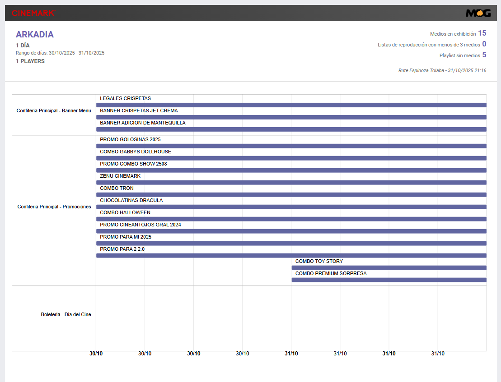

El informe **Timeline** organiza los medios exhibidos dentro del período seleccionado y los presenta en formato de línea temporal, estructurados en una tabla que relaciona el medio con la fecha.
La información se divide por *player*, mostrando el nombre de la *playlist* y del medio correspondiente, lo que permite una visualización continua y cronológica de la programación.

#### 9. Campaña

Clic para expandir

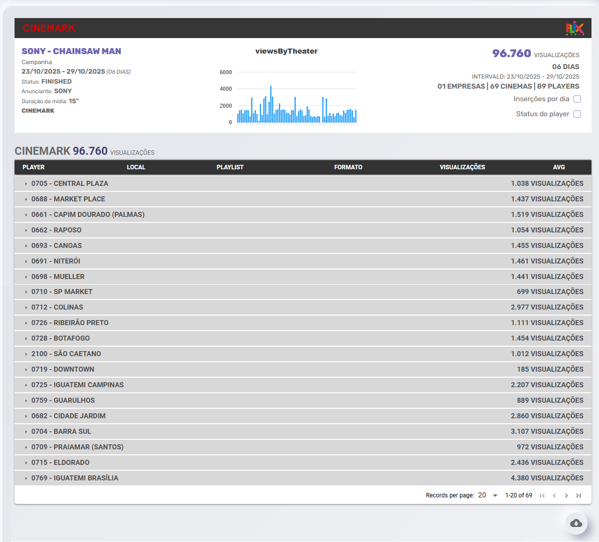

El informe de **Campaña** presenta los datos correspondientes a la campaña seleccionada, organizados por *player* y mostrando el promedio de la cantidad total de visualizaciones (inserciones) registradas durante el período de la campaña.

---

### **1.2 Players y Configuraciones**

#### 1. Salud

Clic para expandir

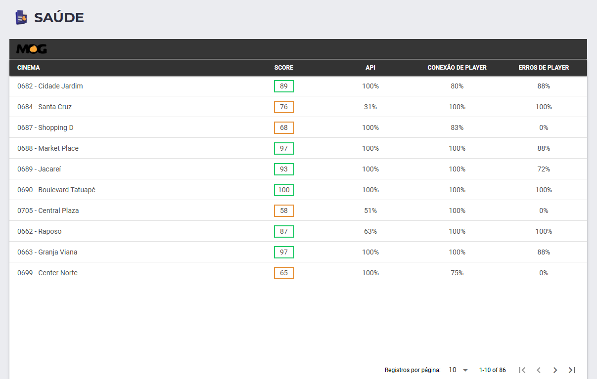

**El informe de Salud** presenta una lista de los cines seleccionados junto con un índice de *score* que varía de 0 a 100, representando la calidad operativa del entorno.
Esta puntuación se calcula en función de la ocurrencia de errores e indicadores técnicos, incluyendo el porcentaje de disponibilidad de la API, la estabilidad de conexión de los *players* y los fallos registrados.
El promedio de estos factores conforma el *score* final mostrado para cada cine.

#### 2. Configuración del Player

Clic para expandir

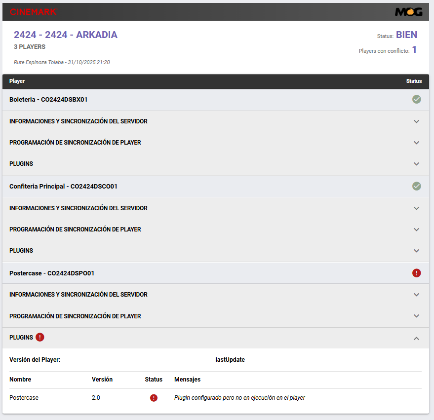

**El informe de Configuración del Player** presenta los estados de funcionamiento organizados por cine y *player* seleccionados.
Muestra la información relacionada con **Información y Sincronización del Servidor**, **Programación de Sincronización del Player** y **Plugins**, permitiendo verificar el estado operativo de cada componente según su respectiva categoría.

#### 3. Medias del Sistema

Clic para expandir

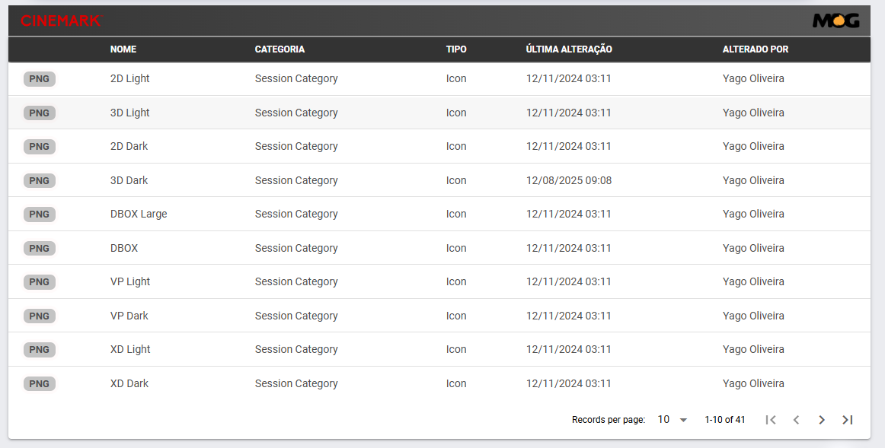

**El informe de Medios del Sistema** presenta todos los medios registrados, organizados por nombre, categoría, tipo, fecha de la última modificación y responsable del cambio.
Este informe permite al usuario verificar todos los medios disponibles en el sistema y hacer un seguimiento de sus respectivas actualizaciones y responsables.

#### 4. Plugins

Clic para expandir

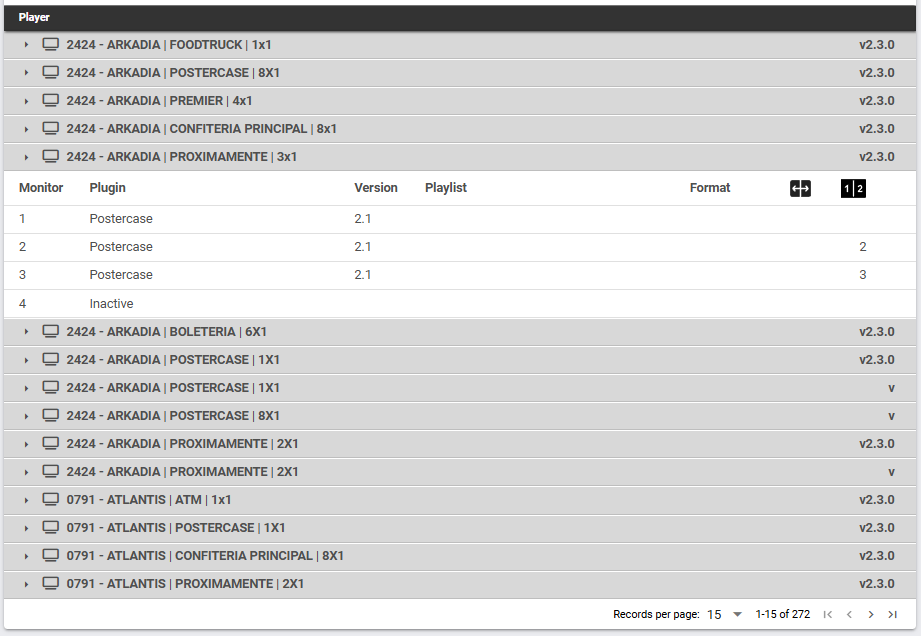

**El informe de Plugins** presenta una visión detallada de la distribución y configuración de los plug-ins en cada player y cine seleccionado.
Muestra la información referente al monitor en el que el plug-in se está ejecutando, el nombre del plug-in, la versión, el nombre de la playlist asociada (cuando corresponda) y el formato de visualización.
El ícono de confirmación indica cuando el plug-in está extendido a otros monitores, junto con la identificación de los monitores correspondientes.

#### 5. Inventário

Clic para expandir

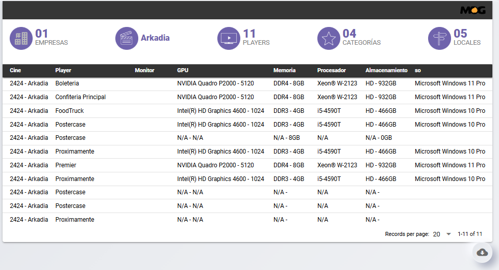

**El informe de Inventario** presenta las especificaciones técnicas de las CPU utilizadas en cada player, organizadas según el cine y el player seleccionados.
Muestra información detallada sobre el monitor, GPU, memoria, procesador, tipo y capacidad de almacenamiento, además del sistema operativo instalado, permitiendo una visión completa de la infraestructura de hardware en uso.

#### 6. Diagrama

Clic para expandir

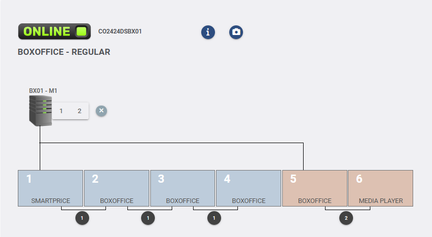

El informe de **Diagrama**muestra la representación visual de la configuración de exhibición según el *cinema* y el *player* seleccionados. El diagrama presenta la relación entre las pantallas, las máquinas y las salidas de video, indicando en qué salida está conectada cada pantalla y qué *plugin* se está ejecutando en cada una de ellas. Es posible interactuar con el informe para ajustar y organizar la disposición de las pantallas de acuerdo con el montaje físico correcto del entorno.

#### 7. API

Clic para expandir

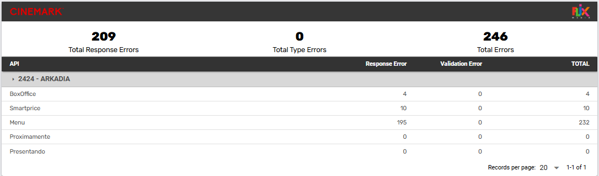

**El informe de API** presenta el monitoreo de posibles errores de conexión y comunicación con las APIs, de acuerdo con el cine y el período seleccionados.
Muestra indicadores de fallos de respuesta, errores de validación y el total de ocurrencias, lo que permite identificar posibles inconsistencias en la integración entre el sistema y los servicios externos.

#### 8. Errores de conexión

Clic para expandir

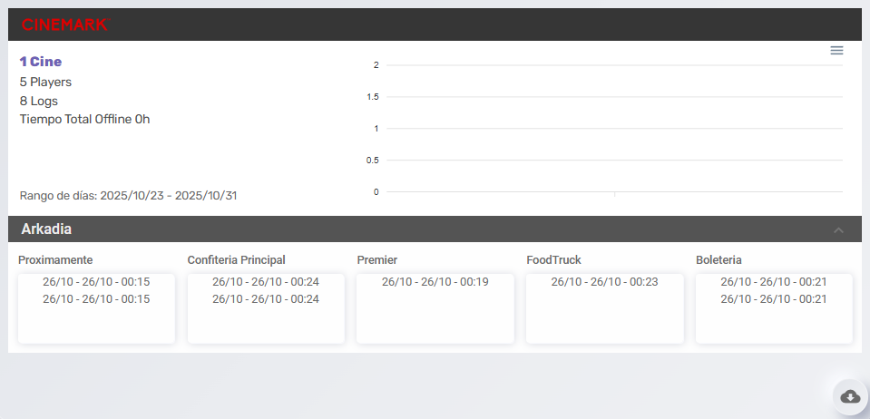

**El informe de Errores de Conexión** presenta los registros de fallos de comunicación ocurridos en el cine y período seleccionados.
Muestra el total de incidencias identificadas y el tiempo total fuera de línea, detallando para cada *player* los intervalos específicos en los que se detectaron errores de conexión, permitiendo un análisis preciso de la estabilidad de la red y del rendimiento operativo.

---

### **1.3 Entretenimento**

#### 1. Evento

Clic para expandir

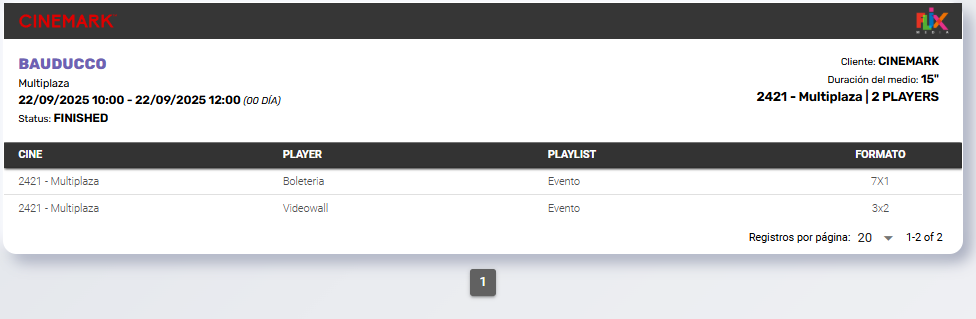

**El informe de Evento** presenta la información referente a la ejecución de un evento específico.
Muestra detalles como el nombre del evento, el nombre del cine, el período de exhibición, el estado, el cliente asociado y la duración de la media.
Además, lista los *players* participantes junto con sus respectivas *playlists* y formatos de exhibición.

#### 2. Layer

Clic para expandir

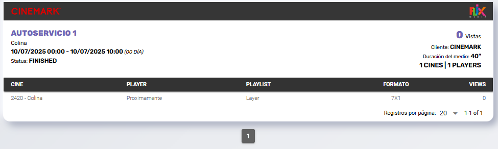

**El informe de Layer** presenta la información referente a la ejecución de un *Layer* específica.
Muestra detalles como el nombre de la programación, el nombre del cine, el período de exhibición, el estado, el cliente asociado y la duración de la media.
Además, lista los *players* participantes junto con sus respectivas *playlists* y formatos de exhibición.

#### 3. Lobby Domination

Clic para expandir

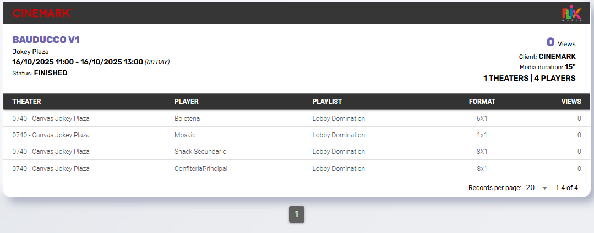

**El informe de Lobby Domination** presenta la información referente a la programación de *Lobby Domination*.
Muestra detalles como el nombre de la programación, el nombre del cine, el período de exhibición, el estado, el cliente asociado y la duración de la media.
Además, lista los *players* participantes con sus respectivas *playlists*, formatos de exhibición y el conteo de visualizaciones (inserciones) registradas durante el período seleccionado.

#### 4. GO Operation

Clic para expandir

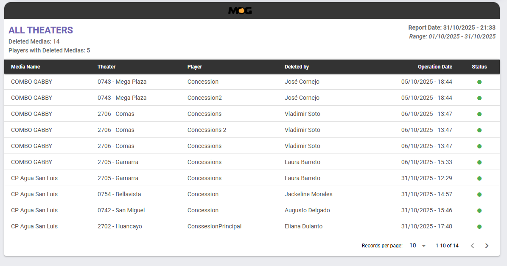

**El informe de GO Operation** presenta el historial de eliminaciones de *medias* promocionales realizadas por los Gerentes Operativos en los cines bajo su responsabilidad.
Muestra información detallada sobre las *medias* eliminadas, incluyendo el nombre de la *media*, el cine, el *player*, el usuario responsable de la eliminación, la fecha y la hora de la operación, así como el estado de la acción.
Este informe permite rastrear y auditar todas las operaciones de eliminación de *medias*, garantizando un mayor control y transparencia en la gestión de las campañas promocionales.
